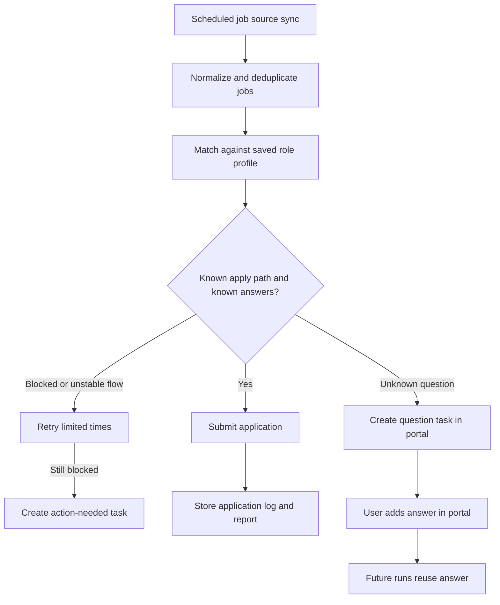

# Job Application Autopilot

## Problem Frame
A single job seeker wants a personal portal that continuously discovers relevant entry-level software jobs, applies automatically when the system has enough information, and surfaces anything ambiguous or blocked instead of failing silently. The product should reduce repetitive job-hunt work while preserving a clear audit trail of what happened, what answers were used, and what still needs human input.

## Requirements

**Discovery and Deduplication**
- R1. The system must ingest jobs on a recurring schedule, at least once every 24 hours.
- R2. The system must support multiple job sources for discovery, including curated sources such as public GitHub job lists and direct job platforms such as ATS-hosted postings.
- R3. The portal must let the user add additional job sources over time.
- R4. The system must normalize jobs from different sources into a shared job record shape.
- R5. When the same job appears in multiple sources, the system must recognize it as one underlying opportunity instead of separate jobs.
- R6. For a deduplicated job, the system must retain all source sightings so the user can see where it was found.

**Apply Path Selection**
- R7. When the same job is available through multiple apply paths, the system must prefer a direct ATS application path over an intermediary source such as LinkedIn.
- R8. The system must submit at most one application per deduplicated job unless the user explicitly resets or reopens that opportunity.
- R9. If no supported direct ATS path is available, the job may remain discoverable without being auto-submitted.

**Targeting and Role Profile**
- R10. The user must be able to describe a target role in natural language, such as “new grad backend software engineer roles.”
- R11. The system must generate a saved role profile from that description, including related titles, seniority phrases, and matching keywords.
- R12. The user must be able to review and update the generated role profile in the portal.
- R13. The system must use the saved role profile to identify jobs that match the user’s intended search scope.
- R14. The initial role profile must support broad entry-level software-engineering targeting, including variants such as new grad, early career, and level-one engineering titles.

**Application Memory and Answer Database**
- R15. The system must maintain a reusable answer database for application questions and answers.
- R16. The answer database must support user-managed additions and edits from the portal.
- R17. For each submitted application, the system must record which questions were asked and which answers were used.
- R18. If the system encounters a required question that is not in the answer database, it must not submit the application.
- R19. Unknown questions must be captured as actionable items in the portal with enough context for the user to answer them later.
- R20. When the user supplies an answer for an unknown question in the portal, future applications must treat that question as known rather than new.

**Execution, Logging, and Recovery**
- R21. The system must keep an application log or report that the user can review in the portal.
- R22. The log must show at least the job, company, source, application status, timestamp, and any question-answer activity associated with the attempt.
- R23. The system must distinguish between successful applications, skipped jobs, blocked applications, and failed attempts.
- R24. The system must retry transient application failures automatically for a limited number of attempts.
- R25. If an application remains blocked after retries, or if the blocker requires human action, the system must create an action-needed item in the portal instead of silently failing.
- R26. The system must preserve enough history for the user to understand what happened on each run and why.

**Portal Experience**
- R27. The portal must provide a dashboard or list view for discovered jobs, application outcomes, and action-needed items.
- R28. The portal must provide a place to manage the answer database.
- R29. The portal must provide a place to resolve newly discovered questions by entering answers.
- R30. The portal must make it clear when a job was discovered but not applied, including the specific reason.
- R31. The portal must let the user view duplicate source sightings for a single deduplicated job.

**Identity and Scope**
- R32. V1 is a personal tool centered on a single user profile and a single base application profile.
- R33. The product should avoid assumptions that would make a future multi-user version unnecessarily difficult, but v1 does not need multi-user workflows or administration.

## Success Criteria
- The system can run daily and continuously surface new relevant jobs without creating duplicate applications.
- The user can see exactly which jobs were applied to, which were skipped or blocked, and why.
- Unknown application questions become visible tasks in the portal rather than silent failures.
- Once the user answers a previously unknown question, future applications can reuse it without re-asking.
- The user can manage both job sources and application answers from the portal without editing code.

## Scope Boundaries
- V1 is not required to support every job board or every application flow on the internet.
- V1 does not need to auto-apply to jobs when required answers are missing.
- V1 does not need per-role resume variants, per-company overrides, or multiple applicant identities.
- V1 does not need collaborative, team, or admin workflows.
- V1 does not need to guarantee application completion for heavily protected or human-verification-heavy flows.

## Key Decisions
- Guardrailed autopilot: Auto-apply only when the system has a supported apply path and all required answers are known.
- Discovery breadth with selective automation: Allow broad discovery sources, but prefer supported direct ATS paths for submission.
- Direct ATS preference: If the same job appears in multiple places, prefer the direct ATS path over LinkedIn or other intermediary sources.
- Human-in-the-loop unknown handling: Missing answers should create portal tasks instead of guesswork or hard failures.
- Broad entry-level targeting: The user wants wide coverage around entry-level software engineering rather than narrow filtering.
- Single base profile: V1 uses one default application identity and answer set.
- Personal-first architecture: Design v1 for one user, while avoiding obvious decisions that would block future multi-user expansion.
- Retry then escalate: Transient failures should retry automatically before becoming action-needed items.

## Dependencies / Assumptions
- Supported job sources will expose enough structured information for discovery and deduplication.
- At least some target application flows will remain stable enough for guarded automation.
- The user is willing to review and maintain an answer database over time.

## Outstanding Questions

### Resolve Before Planning
- None currently.

### Deferred to Planning
- [Affects R2, R7, R9][Technical] Which discovery sources and apply paths should be in the first supported-source matrix for v1?
- [Affects R5, R6, R8][Technical] What deduplication signals should define “same job” across different sources?
- [Affects R18, R19, R20][Technical] How should question matching work so that semantically similar questions can reuse saved answers safely?
- [Affects R24, R25][Technical] What failure categories should count as retryable versus immediately action-needed?
- [Affects R32, R33][Technical] What data model boundaries will keep the personal-first design compatible with future multi-user support?
- [Affects R21, R22, R26][Needs research] What level of application evidence should be stored for trustworthy auditing without creating unnecessary sensitive-data risk?

## Next Steps
→ `/prompts:ce-plan` for structured implementation planning
