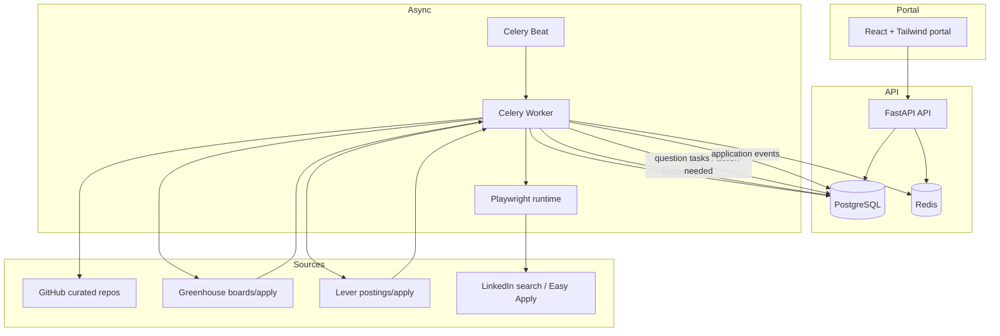

# feat: Build personal job-application autopilot

## Overview

Build a greenfield full-stack application that discovers entry-level software jobs on a 24-hour cadence, deduplicates the same underlying opportunity across multiple sources, prefers direct ATS apply paths, auto-submits only when required answers are known, and gives the user a React portal to manage job sources, answer memory, missing-question tasks, and application reports.

The recommended implementation is a React + Tailwind portal backed by a Python control plane: FastAPI for the API, PostgreSQL for durable state, Redis + Celery for recurring and retryable workflows, and Playwright Python for browser-driven automation where direct APIs are unavailable. This keeps the API, worker, and automation runtime in one language while preserving enough structure to grow beyond a single-user v1 later.

## Problem Frame

The product must reduce repetitive job-search and application work without creating hidden risk for the user. The system should behave like a guarded assistant, not an opaque bot: it should continuously discover jobs, choose the best apply path, reuse known answers, stop when it hits an unknown question, retry transient failures, and produce a trustworthy portal-visible audit trail for every outcome (see origin: `docs/brainstorms/job-application-autopilot-requirements.md`).

This is a Deep plan because the work is greenfield, cross-cutting, and touches external contract surfaces with changing behaviors: ATS APIs, browser automation flows, scheduling, retries, and storage of sensitive applicant data.

## Requirements Trace

- R1-R6: Daily ingestion, multi-source discovery, source management, normalization, deduplication, and source-sighting retention.
- R7-R9: Prefer direct ATS apply targets, avoid duplicate submissions, keep unsupported apply paths discoverable without blind submission.
- R10-R14: Natural-language role profile creation with AI-assisted keyword/title expansion and user-editable targeting.
- R15-R20: Persistent answer database, per-application question/answer logging, unknown-question task creation, and future answer reuse.
- R21-R31: Reporting, statuses, retries, action-needed escalation, portal management screens, and duplicate-visibility UX.
- R32-R33: Personal-first v1 with data-model boundaries that will not block future multi-user expansion.

## Scope Boundaries

- V1 will not try to support every ATS or job board; the first source matrix is GitHub curated feeds, Greenhouse, Lever, and LinkedIn.
- V1 will not auto-answer unknown questions or guess answers during submission.
- V1 will not support multiple applicant identities, per-role resume variants, or collaborative/team workflows.
- V1 will not guarantee completion for captcha-heavy or strongly anti-automation flows; those become action-needed items.
- V1 will not optimize for public self-serve signup. It is a personal tool with minimal owner-only access control.

## Context & Research

### Relevant Code and Patterns

- The repository currently contains no application code beyond the origin requirements doc, so this plan establishes the initial conventions rather than extending existing ones.
- The repo instructions require repo-relative path references and favor clear, low-indirection structure. That fits a two-app layout with `frontend/` and `backend/` plus a shared top-level deployment file.
- Because there are no existing local patterns or tests to mirror, the plan should explicitly create the domain boundaries, naming conventions, and test layout that later work can follow.

### Institutional Learnings

- No `docs/solutions/` directory or institutional learning artifacts currently exist in the repo.

### External References

- Greenhouse Job Board API: https://developers.greenhouse.io/job-board.html
- Lever Developer Docs: https://hire.lever.co/developer/documentation
- LinkedIn Apply Connect and Easy Apply behavior: https://www.linkedin.com/help/linkedin/answer/a514094 and https://www.linkedin.com/help/linkedin/answer/a8068422
- FastAPI background-task guidance, including the note that heavier multi-process work should use a queueing system such as Celery: https://fastapi.tiangolo.com/tutorial/background-tasks/
- Celery current getting-started docs: https://docs.celeryq.dev/en/main/getting-started/first-steps-with-celery.html
- Playwright Python docs: https://playwright.dev/python/
- Tailwind framework guides and Vite-friendly setup: https://tailwindcss.com/docs/installation/framework-guides

## Key Technical Decisions

- **Frontend stack:** Use `frontend/` as a TypeScript React SPA built with Vite and Tailwind CSS v4. This matches the requested React + Tailwind portal while keeping the UI deployment simple and decoupled from worker concerns.
- **Backend stack:** Use `backend/` as a Python FastAPI app with SQLAlchemy 2.0, Alembic, and PostgreSQL. FastAPI keeps API development fast, and SQLAlchemy/Alembic provide explicit schema control for a data-heavy workflow product.
- **Async orchestration:** Use Celery + Redis instead of FastAPI `BackgroundTasks` for discovery, application submission, retries, and scheduled runs. The official FastAPI docs treat in-process background tasks as suitable for small follow-up work and point heavier multi-process work toward a queue-based tool such as Celery.
- **Automation runtime:** Use Playwright Python for browser-driven flows and keep persistent browser profiles on the worker host. This allows source-specific login state, step capture, and failure artifacts without splitting the automation runtime into a second language.
- **Source matrix for v1:** Support `github_curated`, `greenhouse_board`, `lever_postings`, and `linkedin_search` as discovery-source types. Support `greenhouse_apply`, `lever_apply`, and `linkedin_easy_apply` as apply-target types, with direct ATS types always winning when both direct and intermediary targets exist.
- **Deduplication strategy:** Resolve duplicates in ordered tiers: exact external platform job ID, then normalized apply URL, then a fuzzy company-title-location fingerprint with manual-safe conflict handling. Persist every source sighting even when multiple sightings resolve to one canonical job.
- **Question matching safety:** Auto-fill only when a question fingerprint matches exactly after normalization of text, field type, and option labels. AI may suggest likely matches in the portal, but the system must not auto-bind semantically similar questions until the user approves that mapping.
- **Audit evidence policy:** Store structured application events, answer IDs used, redacted payload snapshots, and failure artifacts when needed. Avoid keeping raw screenshots or HTML for successful submissions by default to reduce sensitive-data exposure.
- **Personal-first future-proofing:** Keep an `account_id` boundary in every user-owned table even though v1 serves one account. This preserves future multi-user migration options without forcing multi-user behavior into the product now.
- **Owner-only access control:** Ship minimal session-based owner authentication for the portal and API. Avoid broader auth/product-account complexity, but do not assume the app will only ever be run on localhost.

## Open Questions

### Resolved During Planning

- **Which sources should ship first?** Ship GitHub curated feeds, Greenhouse boards, Lever postings, and LinkedIn search discovery in v1; prioritize direct ATS apply lanes first and treat LinkedIn apply as the highest-risk connector.
- **How should duplicate jobs be detected?** Use tiered dedupe: platform-native external ID, then normalized destination URL, then a fuzzy fingerprint based on normalized company name, role title, and location.
- **How should unknown questions be matched safely later?** Use exact fingerprint matching for automation and AI-assisted suggestion only for human review in the portal.
- **What should count as retryable?** Retry network timeouts, transient upstream 5xx, temporary navigation failures, and browser startup issues; escalate captchas, MFA prompts, missing required answers, and repeated DOM drift to action-needed status.
- **How should evidence be stored?** Persist structured events and redacted answer references for every attempt, and only capture screenshots, trace files, or DOM snapshots for blocked or failed runs.
- **How should future multi-user support stay possible?** Put `account_id` and ownership scoping into the schema and API boundaries from day one, while seeding a single owner account in v1.

### Deferred to Implementation

- Exact SQL column names, enum labels, and migration splits should be finalized while implementing the schema.
- The precise fuzzy-dedup thresholds should be tuned against real imported data after the first fixture set exists.
- LinkedIn DOM selectors, anti-bot pacing, and persistent-login handling should be proven against live flows during implementation because they depend on runtime behavior.
- The exact retention policy for failure artifacts should be set when deployment/storage constraints are concrete.

## High-Level Technical Design

> *This illustrates the intended approach and is directional guidance for review, not implementation specification. The implementing agent should treat it as context, not code to reproduce.*

The backend should expose three clear control loops:

1. **Discovery loop:** Fetch source data, normalize records, dedupe to canonical jobs, and compute the best available apply targets.
2. **Application loop:** Select eligible jobs, fetch current question schemas, resolve answers, submit only when safe, and emit structured events.
3. **Human-resolution loop:** Surface unknown questions and blocked flows into the portal, accept user input, and let future runs continue without reclassifying resolved questions as new.

## Implementation Units

- [ ] **Unit 1: Scaffold the full-stack platform**

**Goal:** Establish the monorepo structure, API/web app skeletons, shared configuration, and owner-only access control so later feature work lands on stable foundations.

**Requirements:** R27-R33

**Dependencies:** None

**Files:**
- Create: `.env.example`
- Create: `docker-compose.yml`
- Create: `frontend/package.json`
- Create: `frontend/vite.config.ts`
- Create: `frontend/tsconfig.json`
- Create: `frontend/src/main.tsx`
- Create: `frontend/src/app/router.tsx`
- Create: `frontend/src/styles/app.css`
- Create: `frontend/src/routes/login.tsx`
- Create: `frontend/src/routes/dashboard.tsx`
- Create: `frontend/src/lib/api.ts`
- Create: `frontend/src/tests/app-shell.test.tsx`
- Create: `backend/pyproject.toml`
- Create: `backend/alembic.ini`
- Create: `backend/app/main.py`
- Create: `backend/app/config.py`
- Create: `backend/app/security.py`
- Create: `backend/app/api/routes/health.py`
- Create: `backend/app/api/routes/auth.py`
- Create: `backend/app/db/session.py`
- Create: `backend/tests/test_health.py`
- Create: `backend/tests/test_auth.py`

**Approach:**
- Start with a simple two-app layout: `frontend/` for the React portal and `backend/` for the FastAPI API, Celery app, and domain code.
- Use secure HTTP-only session cookies for the single owner account rather than a public signup/login model.
- Establish environment-driven configuration for Postgres, Redis, session secret, Playwright profile storage, and source credentials.
- Keep route and module names boring and domain-oriented. This repo has no existing patterns, so simplicity now becomes the future pattern.

**Patterns to follow:**
- Greenfield convention to establish here: API routes under `backend/app/api/routes/`, domain logic under `backend/app/domains/`, integrations under `backend/app/integrations/`, and tests mirrored under `backend/tests/`.
- Greenfield convention to establish here: frontend routes under `frontend/src/routes/`, shared API client helpers under `frontend/src/lib/`, and route-level tests under `frontend/src/tests/`.

**Test scenarios:**
- Happy path: `GET /health` returns a healthy response when API config loads successfully.
- Happy path: owner login creates a valid session and allows access to a protected dashboard bootstrap endpoint.
- Error path: invalid owner credentials do not create a session and return a safe authentication error.
- Error path: protected endpoints reject requests without a valid session.
- Integration: the frontend app shell loads, redirects anonymous users to login, and shows the dashboard shell after successful authentication.

**Verification:**
- The repo boots into a running web app, API, Postgres, and Redis stack with a documented local setup path.
- A new implementer can add backend and frontend features without inventing folder structure or auth plumbing.

- [ ] **Unit 2: Model the control-plane data and management APIs**

**Goal:** Create the persistent schema and API surfaces for sources, role profiles, canonical jobs, source sightings, apply targets, answers, question tasks, application runs, and event logs.

**Requirements:** R3-R6, R10-R20, R21-R31, R32-R33

**Dependencies:** Unit 1

**Files:**
- Create: `backend/app/domains/accounts/models.py`
- Create: `backend/app/domains/sources/models.py`
- Create: `backend/app/domains/jobs/models.py`
- Create: `backend/app/domains/questions/models.py`
- Create: `backend/app/domains/applications/models.py`
- Create: `backend/app/domains/role_profiles/models.py`
- Create: `backend/app/domains/sources/routes.py`
- Create: `backend/app/domains/jobs/routes.py`
- Create: `backend/app/domains/questions/routes.py`
- Create: `backend/app/domains/answers/routes.py`
- Create: `backend/app/domains/role_profiles/routes.py`
- Create: `backend/alembic/versions/20260402_01_initial_control_plane.py`
- Create: `backend/tests/domains/test_source_routes.py`
- Create: `backend/tests/domains/test_role_profile_routes.py`
- Create: `backend/tests/domains/test_question_state_machine.py`
- Create: `backend/tests/domains/test_application_log_routes.py`

**Approach:**
- Model one canonical `job` row per opportunity and a separate `job_sighting` row for every source appearance.
- Represent candidate submission options separately as `apply_target` records so the system can preserve both a direct ATS target and a LinkedIn target for the same job while still applying only once.
- Keep answer-memory data explicit: `question_template`, `answer_entry`, and `question_task` should be separate concepts so new questions can move from unknown to resolved without mutating audit history.
- Store `application_run` as the high-level attempt and `application_event` as the append-only event stream beneath it.
- Include `account_id` across user-owned tables even though a single owner account is seeded for v1.

**Patterns to follow:**
- Follow the domain-first package layout established in Unit 1.
- Keep API responses narrowly shaped for portal screens rather than exposing raw ORM models as public contracts.

**Test scenarios:**
- Happy path: creating a new source saves source-specific settings and returns the normalized source record.
- Happy path: creating or updating a role profile stores the original prompt plus generated keyword/title expansions.
- Edge case: creating a duplicate source with the same unique key for the same account is rejected cleanly.
- Edge case: two sightings resolving to one canonical job preserve both sightings without duplicating the canonical job row.
- Error path: attempting to mark an unresolved question task as reusable without an attached answer entry is rejected.
- Integration: fetching a job detail returns the canonical job, its sightings, current best apply target, related question tasks, and application history in one coherent response.

**Verification:**
- The schema can represent every major state named in the origin requirements without ad hoc JSON blobs becoming the source of truth.
- The portal can manage sources, answers, role profile data, and application history through stable API contracts.

- [ ] **Unit 3: Build recurring discovery and deduplication for stable sources**

**Goal:** Implement the recurring ingestion pipeline for GitHub curated lists, Greenhouse boards, and Lever postings, normalize results, and deduplicate them into canonical jobs with ordered apply-target preference.

**Requirements:** R1-R9, R13-R14, R21-R23, Success Criteria 1

**Dependencies:** Unit 2

**Files:**
- Create: `backend/app/celery_app.py`
- Create: `backend/app/tasks/discovery.py`
- Create: `backend/app/tasks/role_profile_expansion.py`
- Create: `backend/app/integrations/github_curated/client.py`
- Create: `backend/app/integrations/github_curated/parser.py`
- Create: `backend/app/integrations/greenhouse/client.py`
- Create: `backend/app/integrations/lever/client.py`
- Create: `backend/app/domains/jobs/deduplication.py`
- Create: `backend/app/domains/jobs/target_resolution.py`
- Create: `backend/tests/integrations/test_github_curated_parser.py`
- Create: `backend/tests/integrations/test_greenhouse_ingest.py`
- Create: `backend/tests/integrations/test_lever_ingest.py`
- Create: `backend/tests/domains/test_deduplication.py`
- Create: `backend/tests/tasks/test_discovery_task.py`

**Approach:**
- Use Celery Beat to enqueue at least one daily sync task plus ad hoc per-source refresh jobs from the portal.
- Normalize every source adapter into a shared discovery contract containing source identity, external job ID, company, title, location, destination URLs, and available apply-target metadata.
- Apply the tiered dedupe algorithm before persisting canonical jobs.
- Compute a best apply target per job by preferring supported direct ATS targets over LinkedIn or generic external links.
- Expand role-profile prompts asynchronously into normalized keyword/title sets and use them during ingestion to tag candidate matches without preventing broad job storage.

**Execution note:** Start with fixture-driven contract tests for each source adapter before wiring the Celery tasks together.

**Patterns to follow:**
- Mirror the adapter boundary per source type so later connectors can plug into the same normalization pipeline.
- Keep deduplication and target resolution in domain services rather than burying them inside source clients.

**Test scenarios:**
- Happy path: a scheduled GitHub curated sync imports jobs and persists them as canonical jobs plus source sightings.
- Happy path: a Greenhouse discovery payload creates both a canonical job and a preferred direct ATS apply target.
- Happy path: a job seen in GitHub and Greenhouse becomes one canonical job with two sightings and the Greenhouse apply target selected as best.
- Edge case: a Lever posting update refreshes an existing sighting without creating a second canonical job.
- Edge case: a source with malformed rows skips bad records, records the source-level error, and continues processing valid rows.
- Error path: an upstream 5xx or timeout marks the sync as retryable and records the failure in run history.
- Integration: a portal-triggered source refresh enqueues discovery, updates persisted jobs, and returns a visible run record for the user.

**Verification:**
- Daily syncs can populate and refresh the job catalog without duplicate canonical jobs or duplicate apply submissions.
- The system consistently selects direct ATS apply targets when they exist.

- [ ] **Unit 4: Implement guarded application execution for direct ATS flows**

**Goal:** Submit Greenhouse and Lever applications when all required answers are known, create question tasks for unknowns, and emit trustworthy application logs and retry behavior.

**Requirements:** R7-R9, R15-R26, Success Criteria 2-4

**Dependencies:** Unit 3

**Files:**
- Create: `backend/app/tasks/applications.py`
- Create: `backend/app/domains/questions/fingerprints.py`
- Create: `backend/app/domains/questions/matching.py`
- Create: `backend/app/domains/applications/service.py`
- Create: `backend/app/domains/applications/retry_policy.py`
- Create: `backend/app/integrations/greenhouse/apply.py`
- Create: `backend/app/integrations/lever/apply.py`
- Create: `backend/app/domains/applications/redaction.py`
- Create: `backend/tests/domains/test_question_matching.py`
- Create: `backend/tests/domains/test_application_service.py`
- Create: `backend/tests/integrations/test_greenhouse_apply.py`
- Create: `backend/tests/integrations/test_lever_apply.py`
- Create: `backend/tests/tasks/test_application_retry_policy.py`

**Approach:**
- Before submission, fetch the current question schema from the chosen apply target and fingerprint every required field.
- Resolve answers only through exact fingerprint matches and approved answer mappings.
- If any required question is unresolved, stop before submission, persist a `question_task`, and mark the job as blocked-awaiting-answer rather than failed.
- Use source-specific apply adapters for Greenhouse and Lever so their submission details and validation rules stay isolated.
- Record append-only application events for lifecycle steps such as `queued`, `questions_fetched`, `blocked_missing_answer`, `submitted`, `retry_scheduled`, `failed`, and `action_needed`.
- Redact secrets and sensitive freeform answer payloads before storing them in logs.

**Patterns to follow:**
- Reuse the adapter contract from Unit 3 so discovery and application adapters for a platform share common source metadata.
- Keep retry classification in one domain service instead of re-implementing it inside each task.

**Test scenarios:**
- Happy path: a Greenhouse application with complete known answers submits successfully and logs the answer IDs used.
- Happy path: a Lever application with a file-upload answer path submits successfully and records a completed run.
- Edge case: a question with optional fields does not block submission when no answer is stored.
- Edge case: a previously unknown question becomes reusable after the user saves an answer entry and rerunning the application no longer creates a new question task.
- Error path: a required unknown question blocks submission and creates exactly one actionable portal task.
- Error path: a transient upstream timeout schedules a retry and preserves the original run history instead of replacing it.
- Integration: the application event stream for a job shows the chosen apply target, every question fingerprint encountered, and the final outcome in order.

**Verification:**
- The system never submits a direct ATS application with missing required answers.
- The user can trust the application history because every automated decision and blocker is visible and attributable.

- [ ] **Unit 5: Ship the portal workflows for monitoring and human resolution**

**Goal:** Build the React portal screens for dashboarding, source management, role-profile editing, answer-memory management, unknown-question resolution, and job/application detail views.

**Requirements:** R3, R10-R20, R21-R31, Success Criteria 2-5

**Dependencies:** Unit 2, Unit 3, Unit 4

**Files:**
- Create: `frontend/src/routes/jobs.tsx`
- Create: `frontend/src/routes/jobs.$jobId.tsx`
- Create: `frontend/src/routes/sources.tsx`
- Create: `frontend/src/routes/answers.tsx`
- Create: `frontend/src/routes/questions.tsx`
- Create: `frontend/src/routes/role-profile.tsx`
- Create: `frontend/src/components/dashboard/application-summary-cards.tsx`
- Create: `frontend/src/components/jobs/job-table.tsx`
- Create: `frontend/src/components/jobs/job-detail-panel.tsx`
- Create: `frontend/src/components/questions/question-task-form.tsx`
- Create: `frontend/src/components/answers/answer-editor.tsx`
- Create: `frontend/src/components/sources/source-form.tsx`
- Create: `frontend/src/components/role-profile/role-profile-editor.tsx`
- Create: `frontend/src/tests/dashboard.test.tsx`
- Create: `frontend/src/tests/jobs.test.tsx`
- Create: `frontend/src/tests/questions.test.tsx`
- Create: `frontend/src/tests/answers.test.tsx`

**Approach:**
- Keep the portal centered on operational clarity: what was found, what happened, what is blocked, and what needs the user next.
- Build explicit screens for unknown-question resolution and action-needed items instead of burying them in generic job detail views.
- Show duplicate sightings in the job detail UI so the user can see why a job was deduped and which apply target won.
- Keep form flows simple and editable: adding an answer should immediately resolve the corresponding question task state for future runs, while preserving history on old runs.
- Use server-driven route loaders or thin API hooks rather than a thick client-side state layer. This repo is greenfield and does not need heavy frontend abstraction yet.

**Patterns to follow:**
- Follow route-per-workflow organization established in Unit 1.
- Build presentational components around the API shapes from Unit 2 instead of inventing a second client-side domain model.

**Test scenarios:**
- Happy path: the dashboard shows discovered-job totals, recent application outcomes, and action-needed counts from API data.
- Happy path: the sources screen adds a new source configuration and shows its next/last sync metadata.
- Happy path: the answer editor resolves a question task and the question no longer appears as new after refresh.
- Edge case: a job detail page displays multiple sightings for one canonical job and clearly labels the winning apply target.
- Edge case: an application log entry with redacted fields still shows enough context for the user to understand what happened.
- Error path: a failed source refresh or answer save shows a recoverable UI error without corrupting local screen state.
- Integration: after resolving a question task in the portal, the associated job detail updates to show that the blocker has been cleared for future runs.

**Verification:**
- A non-technical user can manage sources, answers, and blocked jobs entirely from the portal.
- The UI makes system decisions legible rather than forcing the user to infer them from raw logs.

- [ ] **Unit 6: Add LinkedIn automation, blocker capture, and operational hardening**

**Goal:** Implement the highest-risk connector separately: LinkedIn discovery/apply automation via Playwright, persistent browser sessions, blocker classification, artifact capture, and production-safety limits.

**Requirements:** R2, R7-R9, R19-R26, R30, Scope Boundaries 1 and 5

**Dependencies:** Unit 3, Unit 4, Unit 5

**Files:**
- Create: `backend/app/integrations/linkedin/session_store.py`
- Create: `backend/app/integrations/linkedin/discovery.py`
- Create: `backend/app/integrations/linkedin/apply.py`
- Create: `backend/app/integrations/linkedin/blockers.py`
- Create: `backend/app/integrations/linkedin/artifacts.py`
- Create: `backend/app/tasks/linkedin.py`
- Create: `backend/tests/integrations/test_linkedin_blockers.py`
- Create: `backend/tests/integrations/test_linkedin_discovery_contract.py`
- Create: `backend/tests/tasks/test_linkedin_retry_and_escalation.py`
- Create: `frontend/src/routes/action-needed.tsx`
- Create: `frontend/src/tests/action-needed.test.tsx`

**Approach:**
- Keep LinkedIn isolated behind its own integration package and task entry points so selector drift and anti-bot mitigations do not pollute the stable ATS adapters.
- Use Playwright persistent contexts and encrypted-at-rest profile configuration so login state survives worker restarts without storing raw passwords in code or plain database fields.
- Apply conservative pacing, attempt caps, and per-day submission limits in the worker to avoid tripping LinkedIn speed-limit and inauthentic-behavior protections.
- Classify blockers into `retryable_transient`, `human_action_required`, and `platform_changed`. Only the first category should auto-retry.
- Capture screenshots, Playwright traces, or DOM excerpts only for blocked and failed flows, then surface them through action-needed records in the portal.

**Execution note:** Treat this unit as a post-core hardening lane. The stable ATS units should ship first so LinkedIn drift does not block the rest of the product.

**Patterns to follow:**
- Reuse the application event stream from Unit 4 and the action-needed UI pattern from Unit 5.
- Keep all browser-specific logic behind the LinkedIn integration boundary rather than letting routes or generic tasks depend on DOM details.

**Test scenarios:**
- Happy path: a LinkedIn discovery run stores candidate jobs and resolves them against existing canonical jobs without duplicating an existing ATS-backed opportunity.
- Edge case: a job that exists on both LinkedIn and Greenhouse remains one canonical job and keeps Greenhouse as the winning apply target.
- Edge case: a known LinkedIn speed-limit page is classified as action-needed or cooldown-required instead of retrying aggressively.
- Error path: captcha, MFA, or unexpected modal flows generate an action-needed item with failure artifacts attached.
- Error path: repeated DOM drift across retries is escalated as `platform_changed` and stops consuming retry budget.
- Integration: the action-needed portal view shows the blocker type, the last attempted step, and a link to relevant artifacts for user follow-up.

**Verification:**
- LinkedIn-specific instability is contained to one integration lane and cannot silently corrupt the core ATS workflows.
- Browser-driven blockers become legible portal tasks instead of disappearing into worker logs.

## System-Wide Impact

- **Interaction graph:** API routes create and manage durable records; Celery Beat schedules discovery and apply tasks; Celery workers execute source connectors and emit application events; Playwright runs only behind integration-specific task boundaries; the portal reads and resolves state through API endpoints.
- **Error propagation:** Source and apply adapters should classify failures into retryable, blocked, or terminal categories and persist that classification in `application_event` or sync-run history instead of throwing opaque worker errors upward.
- **State lifecycle risks:** Duplicate applications, stale answer mappings, and persistent browser-session corruption are the highest lifecycle risks. Mitigate them with unique constraints, append-only event logs, exact-match answer binding, and explicit browser-session reset tooling.
- **API surface parity:** Portal flows for sources, questions, answers, jobs, runs, and action-needed items should all use the same backend status enums and identifiers so the UI does not invent its own lifecycle vocabulary.
- **Integration coverage:** Unit tests alone will not prove ATS apply correctness or browser-flow stability; fixture-backed integration tests and targeted live smoke validation against test accounts will still be needed during execution.
- **Unchanged invariants:** The system must continue to submit at most one application per canonical job, must never auto-answer unknown required questions, and must preserve sighting history even when dedupe collapses multiple source appearances into one job.

## Risks & Dependencies

- **LinkedIn automation risk:** LinkedIn explicitly enforces Easy Apply speed limits and may reduce limits for inauthentic behavior. Mitigation: make LinkedIn a separately isolated connector with pacing, attempt caps, and clear action-needed escalation.
- **Greenhouse custom-apply risk:** Greenhouse’s docs note that custom application posting shifts validation and spam-protection burden to the client. Mitigation: keep Greenhouse submission adapter narrow, validate required fields before submission, and prefer stable direct ATS targets only where question schemas are known.
- **Sensitive-data risk:** Resume content, contact info, and freeform answers are sensitive. Mitigation: use redacted logs, encrypted secrets, minimal artifact retention, and owner-only session auth.
- **Operational dependency:** The app depends on Postgres, Redis, and a worker runtime with a persistent filesystem for Playwright session state and failure artifacts.
- **Fixture dependency:** Reliable development and testing will require captured fixtures or sanitized examples for GitHub, Greenhouse, Lever, and LinkedIn flows before adapter logic can be hardened confidently.

## Alternative Approaches Considered

- **Single-process FastAPI with `BackgroundTasks`:** Rejected because the official FastAPI guidance positions this for smaller same-process follow-up work, while this product needs durable retries, scheduled jobs, and long-running browser automation.
- **Node backend to match the React frontend:** Rejected because the user was already leaning toward Python and a Python backend keeps the API, queue workers, and Playwright automation in one language.
- **Skip LinkedIn entirely in v1:** Tempting for simplicity, but it would drop an explicitly requested source. The better compromise is to isolate it as its own higher-risk implementation unit so it cannot destabilize the direct ATS lanes.

## Phased Delivery

- **Phase 1: Platform and control plane**
  - Unit 1
  - Unit 2
- **Phase 2: Stable discovery and direct ATS applications**
  - Unit 3
  - Unit 4
- **Phase 3: Portal completion**
  - Unit 5
- **Phase 4: LinkedIn connector and operational hardening**
  - Unit 6

## Documentation Plan

- Add a root `README.md` describing the local stack, required services, and environment variables once Unit 1 lands.
- Add operator notes for source setup, Playwright profile/session handling, and action-needed recovery flows once Units 3-6 land.
- Document the answer-database safety model so future contributors understand why exact-match auto-fill is strict and AI suggestions remain human-reviewed.

## Success Metrics

- Daily sync produces new or refreshed jobs without duplicating canonical opportunities.
- Direct ATS applications complete automatically when all required answers are known.
- Unknown required questions consistently surface as portal tasks instead of submission failures.
- The user can inspect per-job history and understand which source won, which answers were used, and why blocked jobs stopped.
- LinkedIn-specific failures are isolated and actionable rather than poisoning the rest of the application pipeline.

## Next Steps

→ `ce:work` can execute this plan in phases, starting with Unit 1 and Unit 2 to establish the stack and data model.
