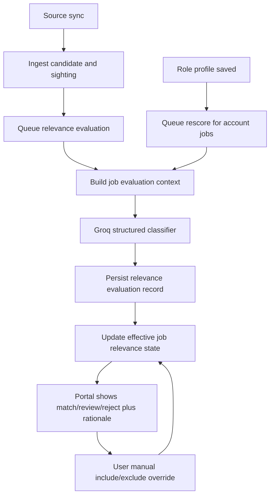

# feat: Replace hardcoded job filtering with an AI relevance engine

## Overview

Replace the current hardcoded title-keyword filter in `backend/app/domains/jobs/relevance.py` with an AI-driven relevance engine that evaluates jobs against the user’s role profile, explains why a job matched or was rejected, and supports safe manual overrides. This plan is a focused follow-on to the autopilot umbrella plan and only covers job relevance classification, discovery visibility, and portal controls for reviewing or overriding relevance decisions.

The recommended implementation is a hybrid-but-AI-first pipeline: ingest every discovered job first, run structured LLM relevance scoring second, and treat hard failures as reviewable rather than silently filtered out. The engine should produce a stable decision (`match`, `review`, `reject`), a score, and human-readable reasons, while preserving enough audit data to rescore jobs later when the role profile changes.

## Problem Frame

The current relevance behavior is too brittle because it treats job targeting as a hardcoded title-matching problem. That leads to false positives like senior or adjacent-discipline roles slipping in, false negatives for unusual early-career titles, and a growing pile of special-case heuristics that are hard to trust. The user explicitly wants to avoid hardcoded filtering logic and prefers an AI layer that understands intent rather than relying on static lists.

This is a Standard plan because it is cross-cutting and changes a core decision surface, but it stays within the existing FastAPI/Celery/React/Groq architecture rather than introducing a new platform or external contract surface.

## Requirements Trace

- R10-R14: Role-profile-driven targeting and AI-assisted expansion must drive job discovery behavior.
- R21-R31: The portal must remain understandable and auditable, including visibility into why jobs were shown or hidden.
- Existing plan decision carry-forward: the system should behave like a guarded assistant, not an opaque bot, and should keep its decisions reviewable in the portal (see origin: `docs/plans/2026-04-02-001-feat-job-application-autopilot-plan.md`).
- New requirement from planning discussion on 2026-04-03: relevance decisions must not depend on expanding hardcoded title/exclusion lists as the primary mechanism.

## Scope Boundaries

- This plan covers relevance classification, visibility state, explanation storage, manual overrides, and rescore behavior.
- This plan does not redesign answer-memory matching or select-option adaptation; that remains separate follow-on work.
- This plan does not replace deduplication logic.
- This plan does not change how applications are submitted once a job is already visible and selected.
- V1 of the relevance engine will use a structured LLM classifier, not embeddings. Embeddings can be added later if scale or latency pushes us there.

## Context & Research

### Relevant Code and Patterns

- `backend/app/domains/jobs/relevance.py` currently makes a boolean relevance decision using hardcoded keyword sets and title heuristics.
- `backend/app/tasks/discovery.py` filters candidates before ingesting them. That is the key architectural limitation because filtered candidates are never persisted for later rescore or audit.
- `backend/tests/tasks/test_discovery_task.py` currently verifies the hardcoded filtering behavior, including regressions around hardware roles and `Engineer I` vs `Engineer II`.
- `backend/app/integrations/openai/role_profile.py` already provides a structured LLM integration path using the Groq-backed OpenAI-compatible client. That is the strongest local pattern to reuse for relevance classification.
- `frontend/src/routes/jobs.tsx` and `backend/app/domains/jobs/routes.py` currently expose only high-level job list data and do not surface any explicit relevance explanation or override state.

### Institutional Learnings

- No `docs/solutions/` artifacts currently exist in the repo.

### External Research

- Skipped for this focused plan. The repo already has a local Groq-backed structured-generation pattern, the workload is personal-scale, and the main planning need is architectural fit rather than framework uncertainty.

## Key Technical Decisions

- **Ingest first, evaluate second:** Source sync should always ingest discovered jobs and sightings before relevance classification. Filtering before persistence is what makes the current system brittle and hard to debug.
- **Separate relevance from lifecycle status:** `Job.status` should stop carrying relevance visibility semantics such as `filtered_out`. Relevance needs its own explicit state so discovery, application lifecycle, and operator review do not share one overloaded column.
- **Use structured LLM classification:** Relevance should be decided by a Groq-backed structured response that returns `decision`, `score`, `summary`, `matched_signals`, and `concerns`. This fits the user’s “let AI decide” requirement while keeping the output inspectable.
- **Bias failures toward review, not rejection:** If the model is unavailable, malformed, or low-confidence, the job should land in `review`, not `reject`. A guarded assistant should fail open for human review rather than silently hiding opportunities.
- **Persist evaluation history:** Store append-only relevance evaluations so the system can explain why a job was classified a certain way, compare decisions after profile changes, and debug model drift.
- **Manual overrides outrank AI:** The user must be able to mark a job as included or excluded in the portal. The effective decision should prefer manual overrides over the latest AI score.
- **Role-profile changes trigger rescore:** Editing the role profile or regenerating titles/keywords should enqueue relevance reevaluation for existing jobs instead of leaving stale visibility state in place.
- **Keep hardcoded rules minimal and structural:** The implementation may keep only very small non-semantic guards where needed for system integrity, but title-family or discipline matching should no longer be expressed as growing keyword sets inside `relevance.py`.

## Open Questions

### Resolved During Planning

- **Should this stay heuristic-based?** No. The engine should use AI classification as the primary decision-maker rather than expanding hardcoded keyword lists.
- **Should relevance happen before or after ingest?** After ingest. Persist first so the system can rescore, explain, and audit every candidate.
- **Should rejections be silent?** No. Rejected jobs should still exist in the database with a stored rationale and optional portal visibility for review.
- **Should manual user corrections be supported?** Yes. The user must be able to override AI decisions from the portal.

### Deferred to Implementation

- The exact JSON schema for model output can be finalized when the classifier client is written.
- Whether portal overrides should initially support only per-job decisions or also reusable title-pattern overrides can be decided during implementation. Start with per-job overrides unless a lightweight pattern form falls out naturally.
- The exact rescore batching strategy can be tuned once real job counts and latency are measured.

## High-Level Technical Design



### Proposed State Model

- `job.lifecycle_status`
  - Existing application-oriented state such as `discovered`, `submitted`, `blocked_missing_answer`
- `job.relevance_decision`
  - `match`, `review`, `reject`, `pending`, `error`
- `job.relevance_source`
  - `ai`, `manual_include`, `manual_exclude`, `system_fallback`
- `job.relevance_score`
  - numeric confidence from the classifier
- `job.relevance_summary`
  - short explanation shown in the portal

### Proposed Evaluation Context

Each evaluation should consider:

- role profile prompt
- generated titles
- generated keywords
- job title
- company name
- location
- normalized source type
- normalized apply-target type when available
- short description snippet when available from the source

### Proposed Classifier Contract

The relevance classifier should return structured JSON shaped like:

```json
{
  "decision": "match | review | reject",
  "score": 0.0,
  "summary": "Why this role matches or not",
  "matched_signals": ["new grad", "backend", "software"],
  "concerns": ["seniority unclear", "government cloud domain"]
}
```

This is directional guidance for review, not implementation specification. The important property is that the output is structured, auditable, and stable enough to store.

## Implementation Units

- [ ] **Unit 1: Split relevance state from job lifecycle and persist evaluation history**

**Goal:** Introduce explicit relevance state and append-only evaluation records so jobs are not hidden by overloaded lifecycle fields.

**Files**
- Update: `backend/app/domains/jobs/models.py`
- Update: `backend/alembic/versions/*`
- Update: `backend/app/domains/jobs/routes.py`
- Create: `backend/app/domains/jobs/relevance_models.py` or keep the new model in `backend/app/domains/jobs/models.py`
- Create: `backend/tests/domains/test_job_routes.py`
- Create: `backend/tests/domains/test_job_relevance_models.py`

**Design Notes**
- Add explicit relevance columns to `Job` and an append-only `JobRelevanceEvaluation` record.
- Keep the current job list API backward-compatible where reasonable, but start exposing relevance fields so the frontend can stop inferring visibility from `status`.
- Preserve existing jobs during migration by mapping current `filtered_out` rows into the new relevance decision model before removing that semantic dependency.

**Test Scenarios**
- Happy path: a job can persist lifecycle status and relevance decision independently.
- Happy path: a new relevance evaluation record is stored without mutating past evaluation history.
- Edge case: a migrated `filtered_out` job becomes `relevance_decision=reject` while keeping its lifecycle intact.
- Integration: job list responses include effective relevance state and summary fields needed by the portal.

- [ ] **Unit 2: Build the Groq-backed relevance classifier service**

**Goal:** Replace the hardcoded boolean matcher with a structured AI evaluator plus safe fallback behavior.

**Files**
- Replace or heavily rewrite: `backend/app/domains/jobs/relevance.py`
- Create: `backend/app/integrations/openai/job_relevance.py`
- Update: `backend/app/config.py`
- Create: `backend/tests/domains/test_job_relevance_service.py`
- Create: `backend/tests/integrations/test_job_relevance_client.py`

**Design Notes**
- Reuse the existing Groq/OpenAI-compatible client pattern from `backend/app/integrations/openai/role_profile.py`.
- Keep one clear service entry point that accepts role profile data plus normalized job context and returns a structured relevance result.
- Do not silently fall back to the old keyword matcher. On classifier failure, return `review` with a machine-readable failure reason.
- Normalize prompt-building and output parsing in one place so later tuning does not sprawl across discovery code.

**Test Scenarios**
- Happy path: a clearly aligned early-career software role is classified as `match` with a positive score and rationale.
- Happy path: a clearly senior or unrelated role is classified as `reject`.
- Edge case: malformed model output falls back to `review` rather than `reject`.
- Edge case: low-confidence output lands in `review`.
- Integration: the classifier client sends and parses structured JSON using the configured Groq model.

- [ ] **Unit 3: Refactor discovery to ingest all candidates and evaluate asynchronously**

**Goal:** Stop losing data at sync time and make relevance evaluation rescorable after ingest.

**Files**
- Update: `backend/app/tasks/discovery.py`
- Update: `backend/app/tasks/role_profile_expansion.py`
- Create: `backend/app/tasks/job_relevance.py`
- Update: `backend/tests/tasks/test_discovery_task.py`
- Create: `backend/tests/tasks/test_job_relevance_task.py`

**Design Notes**
- `sync_source` should ingest every candidate and sighting first, then enqueue relevance evaluation for created or updated jobs.
- Role-profile save/generate flows should enqueue account-wide rescore work rather than relying on incidental future syncs.
- Replace `_refresh_job_visibility` with a rescore path that updates explicit relevance fields instead of toggling `Job.status` between `discovered` and `filtered_out`.
- Keep sync summaries honest: distinguish between `processed`, `ingested`, `matched`, `review`, and `rejected` if the portal needs richer reporting later.

**Test Scenarios**
- Happy path: sync ingests both relevant and irrelevant jobs, then stores different relevance outcomes for them.
- Edge case: classifier failure leaves the job in `review` rather than dropping it.
- Edge case: changing the role profile causes existing jobs to rescore.
- Regression: `Site Reliability Engineer II - Government Cloud` is no longer admitted because of brittle string heuristics; it is classified through the AI path and recorded with rationale.

- [ ] **Unit 4: Add portal visibility, rationale, and manual override controls**

**Goal:** Let the user inspect why jobs were shown or hidden and manually correct relevance when the AI is wrong.

**Files**
- Update: `frontend/src/routes/jobs.tsx`
- Update: `frontend/src/routes/job-detail.tsx`
- Update: `frontend/src/lib/api.ts`
- Update: `backend/app/domains/jobs/routes.py`
- Create: `backend/app/domains/jobs/relevance_routes.py` or extend `routes.py`
- Create: `frontend/src/tests/jobs-relevance.test.tsx`
- Update: `frontend/src/tests/portal-routes.test.tsx`

**Design Notes**
- Show relevance decision, score, and summary in job cards or detail panels.
- Default the main jobs view to `match` and `review`, with a filter or tab for `reject`.
- Add manual `Include` / `Exclude` actions that set override state without deleting evaluation history.
- Surface the latest AI rationale so the user can understand why a job appeared.

**Test Scenarios**
- Happy path: a matched job shows score and rationale in the portal.
- Happy path: manually excluding a job removes it from the default matched list while preserving its record.
- Edge case: a review-state job is visible and clearly labeled as uncertain rather than silently hidden.
- Integration: overriding a job updates its effective relevance decision without erasing prior AI evaluations.

## Dependencies and Sequencing

1. Unit 1 must land before the rest because it establishes the data model and API contract.
2. Unit 2 can begin after Unit 1 defines the persistence shape.
3. Unit 3 depends on Unit 2 because discovery needs the classifier contract.
4. Unit 4 should follow Unit 1 and Unit 3 so the frontend can consume stable relevance fields and override APIs.

## Risks and Mitigations

- **Model drift risk:** The same job may classify differently over time. Mitigation: store model name, profile hash, score, and rationale with each evaluation.
- **Silent-hiding risk:** Bad model output could hide valid jobs. Mitigation: default uncertain or failed evaluations to `review`, not `reject`.
- **Cost and latency risk:** Evaluating every job synchronously during source sync could slow the product noticeably. Mitigation: ingest first, then evaluate in async tasks and rescore only changed jobs or changed-profile jobs.
- **Prompt sprawl risk:** Relevance prompt tuning could become ad hoc. Mitigation: centralize prompt construction and JSON parsing in one classifier module with fixtures/tests.
- **State confusion risk:** Overlapping job lifecycle and relevance state can confuse both code and UI. Mitigation: split them explicitly and stop using `Job.status` as a visibility proxy.

## Rollout and Verification

- Migrate existing `filtered_out` jobs into explicit relevance decision fields before removing old assumptions from routes.
- Ship the classifier behind the existing owner-only portal so the user can sanity-check match/review/reject results on real imports.
- After rollout, rescore all existing jobs once using the current role profile so the portal is internally consistent.
- Verify with a small real fixture set from at least one GitHub curated source and one direct ATS source.

## Success Criteria

- Relevance decisions are no longer driven primarily by hardcoded keyword lists in `backend/app/domains/jobs/relevance.py`.
- Every discovered job has an explicit relevance decision and an inspectable explanation.
- Jobs are ingested even when they are ultimately rejected, so the system can rescore and audit them later.
- The user can manually include or exclude jobs from the portal when the AI gets it wrong.
- Editing the role profile causes existing jobs to rescore instead of leaving stale relevance behavior in place.
