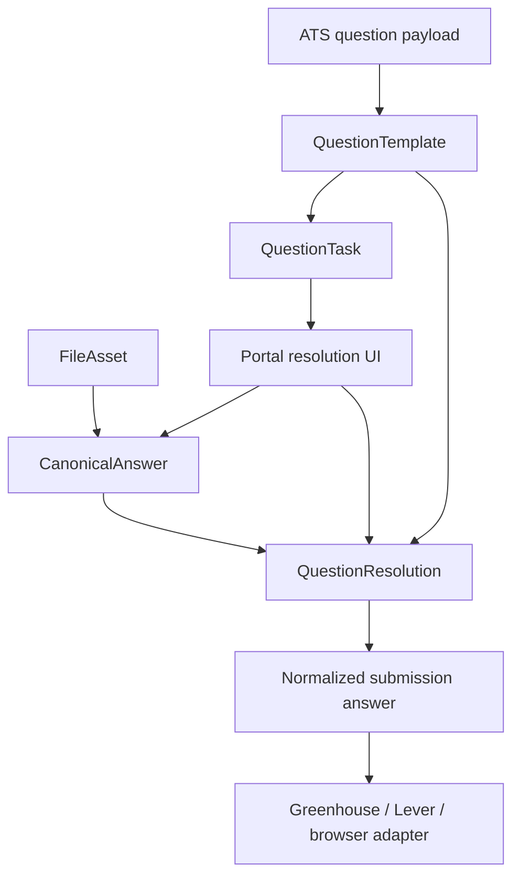

# feat: Redesign question and answer memory for typed, option-aware application forms

## Overview

Redesign the questions and answers system so OpenJob can store, render, validate, and reuse answers based on the real form shape of each question rather than assuming every unresolved prompt is plain text. The new system should support typed answers such as free text, single select, multi select, yes/no, file upload, and future compound answer types, while preserving safe reuse rules when two questions share the same prompt text but expose different allowed options.

The recommended implementation is a typed answer-memory model with three layers:

1. `QuestionTemplate`: what a specific form field looks like, including prompt, field type, option list, and source metadata.
2. `CanonicalAnswer`: the user’s reusable intended answer, independent of any one company form.
3. `QuestionResolution`: a validated mapping from a canonical answer onto a specific question template or template family, including option adaptation rules and file references when needed.

This is a Deep plan because it changes persistence, UI flows, application submission behavior, and the safety model for answer reuse across multiple ATS systems.

## Problem Frame

The current system is good enough for simple text and select questions, but it breaks down as soon as the form shape matters. The screenshot issue shows the immediate symptom: `input_file` questions still render a text area because the current Questions screen only distinguishes single-select, multi-select, and “everything else.” More importantly, the current data model treats reusable answers too much like `prompt -> value`, which is unsafe for select-type questions where the same prompt may present different option sets across jobs.

The product needs a safer and more explicit answer system:

- file upload questions should not ask the user to type text
- select answers should only be reused when the saved answer is valid for the current option set
- the portal should explain why a saved answer can or cannot be applied
- future adaptation should support “preferred meaning” with validated per-question mappings rather than blind prompt reuse

## Requirements Trace

- R15-R20: Maintain a reusable answer database, stop on unknown required questions, surface actionable tasks, and reuse future answers safely.
- R22-R29: Provide portal-visible logs and management screens for answers and question resolution.
- Existing planning decision carry-forward: automation must only auto-fill on exact safe matches and avoid guessing required answers (see origin: `docs/plans/2026-04-02-001-feat-job-application-autopilot-plan.md`).
- New requirement from discussion on 2026-04-03: two questions with the same prompt text must not be treated as equivalent if their allowed options differ, and file-upload questions must be modeled as files instead of text.

## Scope Boundaries

- This plan covers question typing, answer-memory modeling, portal editing/resolution UX, validation, and submission payload shaping.
- This plan does not redesign job relevance or job-source ingestion.
- This plan does not introduce OCR or document generation for resumes, cover letters, or transcripts. File answers will reference existing uploaded assets.
- V1 will support one owner account and one default set of canonical files, not per-company file variants.
- V1 will not auto-map semantically similar options without explicit validation and saved mapping.

## Context & Research

### Relevant Code and Patterns

- `backend/app/domains/questions/models.py` currently stores `QuestionTemplate`, `AnswerEntry`, and `QuestionTask`, but `AnswerEntry` is too generic for typed answer reuse.
- `backend/app/domains/questions/matching.py` currently resolves answers mostly through `question_template_id` and falls back to either `answer_text` or `answer_payload`.
- `frontend/src/routes/questions.tsx` currently renders only three UI branches: multi-select, single-select, and free text. That is why `input_file` still shows a text box.
- `backend/app/integrations/greenhouse/apply.py` and `backend/app/integrations/lever/apply.py` already parse field types and option labels, so the upstream form metadata needed for a typed answer system is already flowing in.
- `backend/app/domains/answers/routes.py` and `frontend/src/routes/answers.tsx` currently expose generic create/edit flows that are not type-aware.

### Institutional Learnings

- No `docs/solutions/` artifacts currently exist in the repo.

### External Research

- Skipped for now. The immediate planning need is internal model and workflow safety, and the repo already exposes the relevant ATS field shapes through the current integrations.

## Key Technical Decisions

- **Stop using one generic answer blob as the main abstraction:** `AnswerEntry` should evolve into typed canonical answers plus explicit mappings, rather than serving as the single container for all answer semantics.
- **Question equivalence must include form shape:** Prompt text alone is not enough. Safe reuse decisions must consider field type and allowed options, and optionally source/provider context where needed.
- **File questions are asset references, not text:** `input_file` and similar fields should resolve to stored file assets with metadata such as label, filename, mime type, path, and allowed use.
- **Separate intent from binding:** The user’s intended answer (for example `linkedin`, `company_website`, `resume_default`) should be distinct from the validated binding used on a specific question template.
- **Option-aware validation outranks convenience:** For single-select and multi-select questions, auto-fill should only proceed when every selected option is valid for the current question or mapped through an approved alias.
- **Portal resolution must be explicit:** When a saved preferred answer is not valid for a new question shape, the portal should show the mismatch, present the allowed options, and ask the user to confirm a new mapping.
- **Submission adapters should consume normalized typed answers:** Greenhouse, Lever, and browser-driven flows should receive shaped values from one normalization layer instead of each adapter inventing its own fallback behavior.
- **Keep auditability first-class:** Every application run should record which canonical answers were used, which question resolutions were applied, and when a fallback or mismatch forced human review.

## Open Questions

### Resolved During Planning

- **Should file questions still use text entry?** No. They should be modeled as uploaded asset selections.
- **Can prompt text alone determine reusable answers?** No. The system must account for field type and option set.
- **Should the product store “preferred answer meaning” separately from per-question bindings?** Yes. That separation is central to safe reuse.
- **Should invalid option mismatches auto-guess a fallback?** No. The system should stop and surface a resolution task unless there is an explicit saved mapping.

### Deferred to Implementation

- The exact schema split between `CanonicalAnswer`, `QuestionResolution`, and file assets can be finalized during migration design.
- Whether reusable option alias maps should live globally or be namespaced by canonical answer kind can be decided when the first UI is implemented.
- The exact upload/storage backend for file answers can stay local-first in v1 and move to cloud storage later if needed.

## High-Level Technical Design

### Proposed Model Split

- `QuestionTemplate`
  - current prompt text
  - normalized field type
  - option labels
  - optional source/provider metadata
  - compatibility fingerprint

- `CanonicalAnswer`
  - reusable answer name
  - answer kind: `text`, `single_select`, `multi_select`, `boolean`, `file`
  - canonical value, such as `linkedin`, `yes`, `resume_default`
  - optional default free-text body
  - optional metadata, including preferred display labels

- `QuestionResolution`
  - links a canonical answer to a specific question template
  - stores validated mapping result
  - may include exact selected option value(s), alias mapping, or file asset link
  - records whether the mapping was explicit user input or derived from an existing safe rule

- `FileAsset`
  - uploaded file metadata
  - category such as `resume`, `cover_letter`, `transcript`
  - display label
  - storage path
  - mime type / extension

### Proposed Typed UI Behavior

- `input_text`, `textarea`, `url`, `phone`, `email`
  - render text or textarea inputs
- `multi_value_single_select`, `radio`
  - render one-choice select/radio controls
- `multi_value_multi_select`, `checkbox`
  - render checklist controls
- `input_file`, `resume`, `attachment`
  - render a file asset picker, not a textarea
- unknown future field types
  - show a clearly labeled unsupported state and block auto-submit until resolved

### Proposed Resolution Rules

1. Exact question-template binding exists
   - reuse immediately
2. Same canonical answer kind and validated compatible mapping exists
   - reuse immediately
3. Same prompt but incompatible option set
   - create a resolution task with mismatch explanation
4. Unsupported field type or missing file asset
   - create a resolution task with the right typed control in the portal

## Implementation Units

- [ ] **Unit 1: Introduce typed answer-memory models and migrations**

**Goal:** Replace the current generic answer-entry-centric model with explicit typed answer entities and per-question bindings.

**Files**
- Update: `backend/app/domains/questions/models.py`
- Update: `backend/alembic/versions/*`
- Update: `backend/app/db/models.py`
- Create: `backend/tests/domains/test_question_answer_models.py`
- Create: `backend/tests/domains/test_question_answer_migration.py`

**Design Notes**
- Preserve existing data during migration by mapping old `AnswerEntry` rows into the new typed model in the most conservative way possible.
- Keep repo terminology explicit: `question template`, `canonical answer`, `question resolution`, and `file asset` should mean different things.
- Favor additive migration steps first so the portal and submission code can move over incrementally.

**Test Scenarios**
- Happy path: a text answer migrates into the new typed model without losing its reusable meaning.
- Happy path: a file asset record can be linked to a canonical file answer.
- Edge case: an old generic answer without `question_template_id` still remains editable after migration.
- Integration: a question template plus canonical answer plus explicit resolution can be loaded together for a future application run.

- [ ] **Unit 2: Build the typed question resolution service**

**Goal:** Centralize answer lookup, option validation, alias mapping, and normalized submission shaping in one backend service.

**Files**
- Replace or heavily rewrite: `backend/app/domains/questions/matching.py`
- Create: `backend/app/domains/questions/resolution.py`
- Create: `backend/tests/domains/test_question_resolution_service.py`
- Update: `backend/tests/domains/test_question_matching.py`

**Design Notes**
- Move all “can this answer be safely reused?” logic into one service.
- Return explicit resolution outcomes such as `resolved`, `needs_mapping`, `missing_file`, `unsupported_type`.
- Normalize answers into an adapter-friendly representation before handing them to Greenhouse, Lever, or browser automation code.

**Test Scenarios**
- Happy path: a text question reuses a bound text answer.
- Happy path: a select question reuses an answer only when the selected option exists in the current allowed list.
- Edge case: the same prompt with a different option set creates a mapping-needed outcome instead of reusing the old value.
- Edge case: a multi-select answer fails safely when one of several saved options is missing from the new option set.
- Error path: an unsupported field type yields a blocked resolution outcome, not a silent free-text fallback.

- [ ] **Unit 3: Add file-answer storage and portal flows**

**Goal:** Make file-based questions usable by giving the user a place to upload, label, and select reusable assets such as resumes.

**Files**
- Create: `backend/app/domains/files/models.py`
- Create: `backend/app/domains/files/routes.py`
- Update: `backend/app/main.py`
- Update: `frontend/src/lib/api.ts`
- Update: `frontend/src/routes/answers.tsx`
- Update: `frontend/src/routes/questions.tsx`
- Create: `frontend/src/routes/files.tsx`
- Create: `frontend/src/tests/files.test.tsx`
- Update: `frontend/src/tests/portal-routes.test.tsx`

**Design Notes**
- Start with local file storage plus metadata in the database.
- For unresolved file questions, render a file asset picker or upload prompt instead of a text area.
- Keep file categories constrained so the portal can distinguish resume-like uploads from generic attachments.

**Test Scenarios**
- Happy path: the user uploads a default resume and can select it for a file-type question.
- Happy path: a resolved file question no longer appears in the Questions queue.
- Edge case: a file question without any compatible uploaded file shows a clear blocking state.
- Error path: invalid file type or missing asset path is rejected cleanly.

- [ ] **Unit 4: Redesign Questions and Answers portal UX around typed resolution**

**Goal:** Make the portal understand what kind of answer is required and show the correct controls and mismatch explanations.

**Files**
- Update: `frontend/src/routes/questions.tsx`
- Update: `frontend/src/routes/answers.tsx`
- Update: `frontend/src/styles/app.css`
- Create: `frontend/src/components/questions/question-resolution-card.tsx`
- Create: `frontend/src/components/answers/canonical-answer-editor.tsx`
- Create: `frontend/src/tests/questions-typed-resolution.test.tsx`
- Create: `frontend/src/tests/answers-typed-editor.test.tsx`

**Design Notes**
- The Questions page should clearly explain why a task is blocked: missing answer, invalid option mapping, missing file, unsupported field type.
- Separate “link existing answer” from “create new canonical answer” from “map preferred meaning to these specific options.”
- Improve copy so the user understands the field type without seeing raw internal terms unless useful.

**Test Scenarios**
- Happy path: a single-select question renders valid options and saves a typed binding.
- Happy path: a file question renders a file picker instead of a textarea.
- Edge case: a previously saved canonical answer is shown as incompatible when the current option set differs.
- Integration: after saving a typed resolution, the Questions queue refreshes and the task disappears.

- [ ] **Unit 5: Update application submission adapters to consume typed normalized answers**

**Goal:** Ensure Greenhouse, Lever, and future browser-driven flows submit the correct answer shape for every supported field type.

**Files**
- Update: `backend/app/integrations/greenhouse/apply.py`
- Update: `backend/app/integrations/lever/apply.py`
- Update: `backend/app/domains/applications/service.py`
- Create: `backend/tests/integrations/test_greenhouse_typed_answers.py`
- Create: `backend/tests/integrations/test_lever_typed_answers.py`
- Update: `backend/tests/domains/test_application_service.py`

**Design Notes**
- Submission adapters should receive normalized typed values from the resolution service, not raw `answer_text`/`answer_payload` blobs.
- File answers should resolve to whatever shape each adapter expects, while preserving the local file reference in audit logs.
- Keep logs redacted but store enough structured detail to understand which canonical answer and resolution path were used.

**Test Scenarios**
- Happy path: a file answer is converted into the correct submission payload for a supported ATS path.
- Happy path: a single-select answer submits the validated option value.
- Edge case: an invalid or stale option binding blocks submission before adapter invocation.
- Integration: an application run records which canonical answer and resolution mapping were used.

## Dependencies and Sequencing

1. Unit 1 must land first because the typed model is the foundation.
2. Unit 2 depends on Unit 1 and should establish the new backend resolution rules before large UI work.
3. Unit 3 and Unit 4 can proceed in parallel once the model and resolution contracts are stable.
4. Unit 5 comes after Unit 2 and should not proceed until typed normalized answers are finalized.

## Risks and Mitigations

- **Migration risk:** Old answers may not map cleanly into the new typed system. Mitigation: migrate conservatively and keep editability for unresolved legacy records.
- **False-safe reuse risk:** Prompt-only reuse could still slip through if compatibility checks are incomplete. Mitigation: centralize validation and require exact option compatibility or explicit saved mappings.
- **Portal complexity risk:** A typed resolution UI can become overwhelming. Mitigation: separate concerns into clear task states and keep the common path simple.
- **File-storage risk:** Local file references can drift or disappear. Mitigation: store metadata plus existence validation and surface broken assets as actionable tasks.
- **Adapter drift risk:** Different ATS systems may represent the same field type differently. Mitigation: normalize internally first, then translate per adapter with targeted tests.

## Rollout and Verification

- Ship the typed model and resolution service behind the existing owner-only portal.
- Migrate old answers first, then move the Questions UI from generic text fallback to typed controls.
- Keep application submission blocked for unsupported field types until the adapter updates are complete.
- Validate against at least one Greenhouse flow with select questions and one flow with file upload requirements.

## Success Criteria

- `input_file` and similar file questions no longer render as generic text areas.
- The system no longer assumes that two questions with the same prompt are safely reusable when their option sets differ.
- The portal shows the correct control type for each unresolved question and explains mismatches clearly.
- Select answers are only auto-reused when the saved answer is valid for the current option set or explicitly mapped.
- Application runs record which typed canonical answers and per-question resolutions were used.
