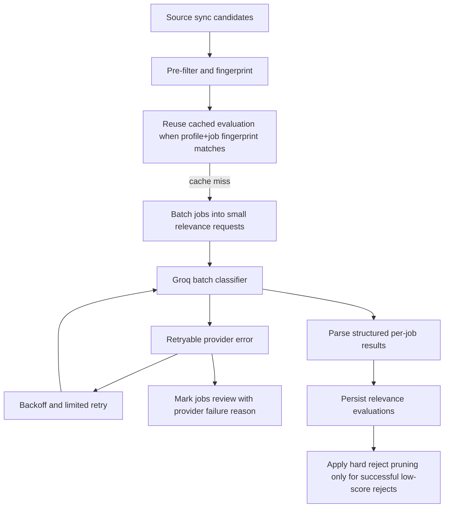

# feat: Harden relevance classification for throughput, rate limits, and batch scoring

## Overview

Improve the AI relevance engine so it survives real source sync volume without degenerating into blanket `review` decisions. The current implementation sends one Groq request per job, performs extra reevaluation passes during sync, and collapses all model failures into the same fallback summary. This plan adds explicit error classification, bounded batching, retry and backoff behavior, cached reuse where safe, and better portal visibility into why a job ended up in `review`.

This is a follow-on to the AI relevance engine plan in `docs/plans/2026-04-03-002-feat-ai-relevance-engine-plan.md`. It narrows scope to throughput, reliability, and operator clarity for relevance evaluation rather than redesigning the whole discovery or answer-memory system.

## Problem Frame

The system now depends on an LLM for relevance, which matches the product direction, but the current runtime behavior is too fragile for real sync sizes:

- one job currently means one `chat.completions.create(...)` call in `backend/app/integrations/openai/job_relevance.py`
- source sync evaluates candidates inline in `backend/app/tasks/discovery.py`
- sync can also reevaluate existing jobs in the same run
- all runtime failures currently collapse to the generic fallback summary `AI relevance classification failed, so this job needs review.`
- there is no rate-limit awareness, backoff, retry budget, batching, or cache reuse

That creates three user-facing problems:

1. a medium-sized sync can produce too many model calls
2. Groq outages or 429s become indistinguishable from real ambiguity
3. the portal fills with `review` jobs for operational reasons rather than product reasons

## Requirements Trace

- Carry forward from `docs/plans/2026-04-03-002-feat-ai-relevance-engine-plan.md`: relevance should stay AI-driven, auditable, and reviewable rather than reverting to hardcoded title logic.
- New requirement from 2026-04-04 discussion: the relevance engine must not degrade all jobs to `review` when model configuration, rate limits, or provider errors occur.
- New requirement from 2026-04-04 discussion: the system should not issue one unbounded LLM call per job without throughput controls.
- Existing product requirement carry-forward: the portal should remain understandable to operators, which means system-caused `review` states must be visibly different from true ambiguity.

## Scope Boundaries

- This plan covers relevance evaluation reliability, batching, cache reuse, sync orchestration, and portal messaging for relevance errors.
- This plan does not redesign the role-profile prompt structure beyond what is needed for batch evaluation.
- This plan does not redesign source ingestion or deduplication semantics.
- This plan does not redesign question/answer memory.
- This plan does not move to embeddings. The immediate goal is to make the existing Groq-backed classifier operationally safe.

## Context & Research

### Relevant Code and Patterns

- `backend/app/integrations/openai/job_relevance.py` issues a single `client.chat.completions.create(...)` call per classification and catches all exceptions broadly.
- `backend/app/tasks/discovery.py` evaluates every candidate inline during sync, then may run `_refresh_job_visibility(...)` over stored jobs again.
- `backend/app/domains/jobs/relevance.py` already centralizes result application and evaluation-history storage, so it is the correct place to integrate richer failure metadata without spreading logic across the app.
- `frontend/src/routes/jobs.tsx` and `frontend/src/routes/job-detail.tsx` already expose relevance state and rationale, so portal-facing reliability messaging can extend that existing UI surface instead of inventing a new screen.
- `backend/app/config.py` now correctly resolves the repo-root `.env`, which fixed one concrete cause of blanket fallback behavior.

### Institutional Learnings

- No `docs/solutions/` artifacts currently exist for AI rate limiting, batched model inference, or provider failover.

### External Research Decision

This work warrants external research if we were choosing between provider-specific batching APIs, queue semantics, or SDK retry behavior. For this plan, local context is already strong enough to produce a concrete design because the repo uses a single OpenAI-compatible client and the immediate gaps are architectural, not documentation ambiguity. Proceeding without external research is reasonable here.

## Key Technical Decisions

- **Separate ambiguity from infrastructure failure:** `review` should remain a valid product decision, but the system must also persist a machine-readable reason such as `provider_rate_limited`, `provider_unavailable`, `config_missing`, or `malformed_response`.
- **Introduce bounded batch classification:** Relevance should classify small groups of jobs per call instead of one job per request. Batch size should be conservative in v1, tuned for predictable latency and model output stability rather than maximal packing.
- **Keep batching optional and degradable:** If a batch fails, the system should be able to retry at smaller granularity rather than losing the whole sync result.
- **Add retry with backoff only for retryable provider failures:** 429s, transient network failures, and provider 5xx responses should retry within a bounded budget. Invalid responses or prompt/schema violations should not spin.
- **Reduce duplicate reevaluation during sync:** Candidate relevance should be evaluated once per sync path unless there is a specific reason to rescore existing jobs. Full-account rescore belongs in dedicated rescore tasks, not in every sync.
- **Cache by profile snapshot plus job fingerprint:** If the same job content and same role-profile snapshot are seen again, reuse the latest compatible evaluation instead of calling the model again.
- **Expose system-caused review states in the portal:** The UI should distinguish `Needs review` because the role is ambiguous from `Needs review` because the provider was rate-limited.
- **Preserve hard-reject pruning, but only after successful AI evaluation:** The current hard-reject drop rule is still valid, but it must never treat provider failure as a reject.

## Open Questions

### Resolved During Planning

- **Should we keep one request per job?** No. We should move to bounded batch scoring.
- **Should every fallback still become generic `review`?** No. The decision may stay `review`, but the cause must be explicit and operator-visible.
- **Should sync rescore all jobs every time?** No. Sync should evaluate changed candidates only, while account-wide rescoring stays in dedicated flows.

### Deferred to Implementation

- The exact initial batch size should be validated against real Groq response size and latency. Start conservatively.
- Whether batch prompts should classify jobs as a flat array or keyed object map can be finalized when implementing the parser.
- Whether to add provider failover beyond Groq in this slice can be deferred; start with robust Groq handling first.

## High-Level Technical Design



### Proposed Failure Taxonomy

Each evaluation should carry one of these reliability causes when applicable:

- `none`
- `config_missing`
- `provider_rate_limited`
- `provider_timeout`
- `provider_unavailable`
- `provider_response_invalid`
- `batch_partial_failure`

The effective user-facing decision can still be `review`, but the portal and logs should know why.

### Proposed Batching Shape

Directional guidance only:

```json
{
  "role_profile": {
    "prompt": "...",
    "generated_titles": ["..."],
    "generated_keywords": ["..."]
  },
  "jobs": [
    {
      "job_key": "<stable fingerprint>",
      "title": "...",
      "company_name": "...",
      "location": "...",
      "source_type": "...",
      "apply_target_type": "...",
      "description_snippet": "..."
    }
  ]
}
```

And the model should return one structured result per `job_key`.

## Implementation Units

- [ ] **Unit 1: Add explicit provider-failure metadata to relevance results and portal surfaces**

**Goal:** Stop collapsing all AI failures into one generic fallback summary.

**Files**
- Update: `backend/app/integrations/openai/job_relevance.py`
- Update: `backend/app/domains/jobs/relevance.py`
- Update: `backend/app/domains/jobs/models.py`
- Update: `backend/app/domains/jobs/routes.py`
- Update: `frontend/src/routes/jobs.tsx`
- Update: `frontend/src/routes/job-detail.tsx`
- Update: `frontend/src/lib/api.ts`
- Create: `backend/tests/integrations/test_job_relevance_failures.py`
- Update: `frontend/src/tests/portal-routes.test.tsx`

**Design Notes**
- Extend `JobRelevanceResult` with a reliability/failure cause field.
- Distinguish `config_missing`, `provider_rate_limited`, and generic provider failure in summaries and stored payloads.
- Keep `review` as the safe decision, but update summaries so operators know whether the job is ambiguous or the system is unhealthy.

**Test Scenarios**
- Happy path: successful AI classification has no failure cause.
- Edge case: missing Groq configuration yields `review` plus `config_missing`.
- Edge case: simulated 429 yields `review` plus `provider_rate_limited`.
- Portal: jobs page shows a clearer rationale for provider-caused review states.

- [ ] **Unit 2: Implement bounded batch relevance classification with per-job parsing**

**Goal:** Reduce provider call volume and improve sync throughput.

**Files**
- Replace or extend: `backend/app/integrations/openai/job_relevance.py`
- Update: `backend/app/domains/jobs/relevance.py`
- Update: `backend/app/config.py`
- Create: `backend/tests/integrations/test_job_relevance_batch_client.py`
- Update: `backend/tests/domains/test_job_relevance_service.py`

**Design Notes**
- Add a batch entry point that accepts multiple normalized jobs and returns a result keyed per job fingerprint.
- Keep the existing single-job path as a fallback for degraded retry behavior and low-volume flows.
- Introduce conservative config such as `RELEVANCE_BATCH_SIZE`, defaulting to a small number.
- Validate model output strictly; malformed or missing per-job entries should fall back only for the affected jobs.

**Test Scenarios**
- Happy path: one batch request returns structured decisions for multiple jobs.
- Edge case: one malformed item in the batch only affects that item, not the whole batch.
- Edge case: oversized or malformed batch response falls back safely.
- Regression: single-job path still works when batch mode is disabled.

- [ ] **Unit 3: Add retry, backoff, and degraded fallback for retryable provider errors**

**Goal:** Handle 429s and transient outages without immediately flooding the portal with false-review jobs.

**Files**
- Update: `backend/app/integrations/openai/job_relevance.py`
- Create: `backend/app/domains/jobs/relevance_retry.py` or keep helpers local if small
- Update: `backend/app/config.py`
- Create: `backend/tests/integrations/test_job_relevance_retry.py`

**Design Notes**
- Retry only retryable failures: 429, timeouts, transport errors, provider 5xx.
- Use bounded exponential backoff with a small max-attempts budget.
- On batch failure after retry budget, split to smaller batches or single-job fallback before giving up.
- Do not retry schema or parse failures indefinitely.

**Test Scenarios**
- Happy path: transient failure succeeds on retry.
- Edge case: repeated 429 exhausts retries and yields explicit `provider_rate_limited` review state.
- Edge case: malformed JSON response does not retry pointlessly.
- Edge case: partial batch degradation falls back to smaller units.

- [ ] **Unit 4: Add profile-aware relevance caching and remove duplicate sync reevaluation**

**Goal:** Avoid paying the model twice for effectively the same relevance question.

**Files**
- Update: `backend/app/domains/jobs/relevance.py`
- Update: `backend/app/tasks/discovery.py`
- Update: `backend/app/domains/jobs/models.py`
- Update: `backend/alembic/versions/*`
- Create: `backend/tests/tasks/test_discovery_relevance_caching.py`

**Design Notes**
- Compute a job fingerprint from title, company, location, apply target type, and normalized description snippet.
- Reuse the latest evaluation when the job fingerprint and profile snapshot hash still match.
- Remove or sharply narrow `_refresh_job_visibility(...)` so sync does not rescore the whole account on every source run.
- Keep dedicated account-wide rescoring for explicit profile changes.

**Test Scenarios**
- Happy path: unchanged job + unchanged profile reuses cached relevance and avoids a new model call.
- Edge case: profile edit invalidates cache and triggers a fresh evaluation.
- Edge case: changed description or apply target invalidates cache.
- Regression: sync no longer doubles relevance calls for the same source run.

- [ ] **Unit 5: Tighten dashboard and operator semantics for large sync volumes**

**Goal:** Make high job counts understandable and stop conflating visibility with storage.

**Files**
- Update: `frontend/src/routes/dashboard.tsx`
- Update: `frontend/src/routes/jobs.tsx`
- Update: `backend/app/domains/jobs/routes.py`
- Update: `frontend/src/lib/api.ts`
- Update: `frontend/src/tests/app-shell.test.tsx`
- Update: `frontend/src/tests/portal-routes.test.tsx`

**Design Notes**
- Keep `Visible jobs` as the primary metric, not raw persisted row count.
- Add or expose a `Review because system issue` distinction when relevant.
- Consider a small breakdown such as `match`, `review`, and `manual exclude` if it materially improves operator trust.

**Test Scenarios**
- Happy path: dashboard counts visible jobs without including hard-pruned rejects.
- Edge case: jobs in provider-failure review states are labeled differently from normal ambiguous reviews.
- Integration: jobs list remains understandable when hundreds of jobs are present.

## Dependencies and Sequencing

1. Unit 1 comes first so the system can express why relevance failed before we change throughput behavior.
2. Unit 2 follows because batch classification changes the main client contract.
3. Unit 3 depends on Unit 2 because retries and degraded fallbacks must work with batched requests.
4. Unit 4 follows once the client and retry behavior are stable, so cache keys reflect the final evaluation inputs.
5. Unit 5 can land after Unit 1 and Unit 4, once the backend semantics are stable enough for the dashboard and jobs UI.

## Risks and Mitigations

- **Batch response instability:** Larger prompts can increase malformed output. Mitigation: keep v1 batch size conservative and support degraded single-job fallback.
- **Hidden provider outages:** If failures still look like ordinary review states, operators will distrust the system. Mitigation: add explicit failure taxonomy and visible summaries.
- **Retry storms:** Naive retries can make rate limits worse. Mitigation: bounded exponential backoff, low retry counts, and smaller fallback batches.
- **Cache poisoning:** Reusing stale relevance can hide newly relevant jobs. Mitigation: include profile snapshot and job fingerprint in the cache key.
- **Portal complexity creep:** Too many technical states can overwhelm the UI. Mitigation: keep operator-facing language simple while storing richer machine-readable causes underneath.

## Rollout and Verification

- Ship the config and failure-taxonomy fixes first so operator messaging improves immediately.
- Roll out batch classification behind a config flag or conservative default batch size.
- After rollout, run a controlled rescore against one medium-sized source and inspect:
  - total model calls
  - number of retryable failures
  - number of provider-caused review states
  - final visible job count
- Verify that a medium sync no longer emits one unbounded provider call per job without caching or degraded fallback.
