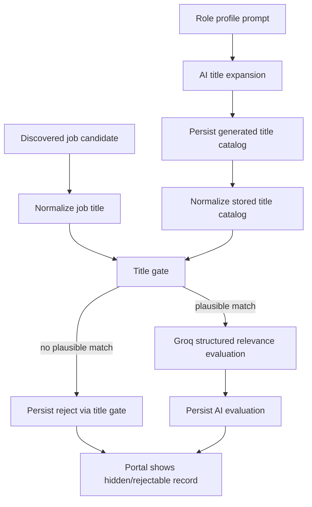

# feat: Move relevance to title-first gating with AI review on plausible jobs only

## Overview

Refactor the current AI-first relevance engine into a two-stage pipeline:

1. build and persist a much richer generated-title catalog from the role profile
2. gate discovered jobs by normalized title similarity before any LLM call
3. send only title-plausible jobs to Groq for structured relevance evaluation

This plan intentionally removes generated keywords from the role-profile-driven relevance path. The user wants broad coverage through title variants, not loose keyword expansion that leaks adjacent specialties like machine learning into otherwise irrelevant matches.

## Problem Frame

The current relevance engine asks the model to evaluate almost every job and then relies on `match / review / reject` to sort them out. That leads to two product failures:

- clearly wrong jobs like `Staff Machine Learning Engineer` or `Data Engineer` still show up in `review`
- title keyword expansion pollutes the profile with broad terms that make the classifier too permissive

The user wants obvious title mismatches to be rejected before AI is involved. AI should spend tokens only on jobs that are already plausible title-family matches.

## Requirements Trace

- Carry forward from `docs/brainstorms/job-application-autopilot-requirements.md`: role targeting must come from a saved role profile that can cover many entry-level title variants (see origin: `docs/brainstorms/job-application-autopilot-requirements.md`).
- Carry forward from `docs/plans/2026-04-03-002-feat-ai-relevance-engine-plan.md`: relevance must remain auditable and reviewable in the portal, and hardcoded exclusion lists must not become the primary decision mechanism (see origin: `docs/plans/2026-04-03-002-feat-ai-relevance-engine-plan.md`).
- New requirement from 2026-04-04 discussion: generated keywords should no longer drive relevance.
- New requirement from 2026-04-04 discussion: generated titles should be as exhaustive as practical, including formatting, ordering, and level variants.
- New requirement from 2026-04-04 discussion: if a job title is not a plausible match for the saved title catalog, the system should reject it without sending it to AI.

## Scope Boundaries

- This plan covers role profile title generation, normalized title matching, discovery gating, and the updated AI relevance trigger.
- This plan does not redesign application submission, answer memory, or job deduplication.
- This plan does not introduce embeddings or a vector database in v1. Title gating is small-catalog lookup, not semantic retrieval at web scale.
- This plan keeps manual include/exclude controls and evaluation history intact.

## Context & Research

### Relevant Code and Patterns

- `backend/app/tasks/role_profile_expansion.py` currently produces both generated titles and generated keywords.
- `backend/app/domains/role_profiles/models.py` persists both arrays on the profile.
- `backend/app/tasks/discovery.py` currently evaluates candidate relevance directly after candidate loading.
- `backend/app/integrations/openai/job_relevance.py` already provides the structured Groq-backed evaluation path for the second-stage classifier.
- `backend/app/domains/jobs/relevance.py` already stores append-only evaluation records and profile-aware cache metadata.

### Decision on Vector Search

Vector search is not the right first step here.

- The candidate set per source sync is small enough for in-memory normalized title comparison.
- The title catalog per user is also small enough to normalize and compare directly.
- The main problem is not semantic retrieval quality at scale; it is that we are asking AI to judge jobs that never should have reached AI.
- A vector store would add infrastructure and ambiguity before the basic title-first contract is proven.

If future scale or title fuzziness becomes a problem, embeddings can be revisited as an optional second-generation matcher. For this iteration, normalized token-aware title matching is the right fit.

## Key Technical Decisions

- **Drop generated keywords from relevance inputs:** Keywords are the main source of profile drift and adjacent-track leakage. The relevance pipeline should be title-driven.
- **Keep AI for generation, not first-pass matching:** AI should still expand the user’s prompt into a richer title catalog, but it should not evaluate obviously implausible titles.
- **Generate an extensive title catalog:** The role profile should persist a broad set of title variants, including ordering changes, punctuation changes, level synonyms, and common early-career phrasing.
- **Use normalized title matching as the first gate:** Normalize punctuation, separators, level markers, casing, and token order enough to recognize title variants without depending on brittle literal string equality.
- **Reject out-of-catalog titles before AI:** If a discovered job title cannot plausibly match the generated title catalog, mark it `reject` without calling Groq.
- **Reserve AI for plausible titles only:** Groq should evaluate family fit, seniority nuance, company/domain context, and borderline cases after the title gate passes.
- **Persist gate provenance:** Jobs rejected at the title gate should still record that they were rejected by the title matcher, not by AI, so the portal stays truthful.
- **Preserve user overrides:** Manual include/exclude must continue to outrank automated decisions.

## Open Questions

### Resolved During Planning

- **Should we keep generated keywords?** No. Title-first matching replaces them for relevance.
- **Should embeddings/vector search power the title gate?** No for v1. The added complexity is not justified for a per-user title catalog.
- **Should AI still see obviously wrong titles?** No. Title gate first, AI second.

### Deferred to Implementation

- The exact normalized title matching strategy can be finalized during implementation, as long as it is deterministic, transparent, and not a creeping deny-list of specialty words.
- Whether the portal should expose the full generated title catalog or only an editable subset can be decided during implementation. Start with stored arrays and API visibility.

## High-Level Technical Design



## Proposed Title-Gate Model

The title gate should compare normalized titles, not raw strings.

Normalization should include:

- lowercase folding
- punctuation and separator normalization
- collapse whitespace
- normalize level markers such as `I` and `1`
- normalize ordering noise such as commas and parentheses

The matcher should support at least these matching shapes:

- exact normalized match
- token-set match for reorderings like `Software Engineer, New Grad`
- level-equivalent match like `Software Engineer I` vs `Software Engineer 1`
- close variant match for AI-generated catalog entries that differ only by separators or label ordering

This remains deterministic matching, but it is not a hand-maintained title deny-list. The title universe still comes from the generated profile.

## Proposed Role Profile Shape

The role profile should become:

- `prompt`
- `generated_titles`
- optional future `title_examples_included`
- optional future `title_examples_excluded`

`generated_keywords` should no longer participate in title gating or AI relevance prompts. The existing column can be deprecated in place first, then removed later if nothing else depends on it.

## Proposed AI Classifier Contract

For titles that pass the gate, the classifier should consume:

- profile prompt
- generated titles
- matched title candidates from the gate
- job title
- company name
- location
- source type
- apply target type
- description snippet when available

The classifier should return structured JSON shaped like:

```json
{
  "decision": "match | review | reject",
  "score": 0.0,
  "summary": "Why the plausible title still does or does not fit",
  "matched_signals": ["early career", "backend", "software engineer i"],
  "concerns": ["government domain", "seniority phrasing unclear"]
}
```

The important change is that AI no longer decides whether `Data Engineer` is even in family for a `Software Engineer I / New Grad` profile unless the title gate already thinks it is plausible.

## Implementation Units

- [ ] **Unit 1: Refactor role profile expansion to generate a larger title catalog and stop depending on keywords**

**Goal:** Make the saved profile title-first and broad enough to cover common ordering and formatting variants.

**Files**
- Update: `backend/app/tasks/role_profile_expansion.py`
- Update: `backend/app/integrations/openai/role_profile.py`
- Update: `backend/app/domains/role_profiles/routes.py`
- Update: `backend/app/domains/role_profiles/models.py`
- Update: `frontend/src/routes/role-profile.tsx`
- Update: `frontend/src/lib/api.ts`
- Create: `backend/tests/tasks/test_role_profile_expansion.py`
- Update: `frontend/src/tests/portal-routes.test.tsx`

**Design Notes**
- Keep AI generation, but ask for a much richer list of title variants instead of broad keywords.
- Preserve the existing schema compatibly first; it is acceptable to keep `generated_keywords` stored but unused until a cleanup migration.
- The portal should reflect that titles drive matching now.

**Test Scenarios**
- Happy path: a prompt like `software engineer 1 / new grad` yields many ordering and level variants.
- Edge case: duplicate or punctuation-only variants collapse to unique stored entries.
- Regression: role profile save still works when the generated-keywords field is empty or ignored.

- [ ] **Unit 2: Build normalized title matching and catalog comparison**

**Goal:** Introduce a deterministic first-pass gate that can reject implausible titles before AI.

**Files**
- Create: `backend/app/domains/jobs/title_matching.py`
- Update: `backend/app/domains/jobs/relevance.py`
- Update: `backend/tests/domains/test_job_title_matching.py`
- Update: `backend/tests/domains/test_job_relevance_service.py`

**Design Notes**
- Keep the matcher deterministic and explainable.
- Return structured gate output such as:
  - matched or not
  - matched catalog titles
  - normalized title used
  - gate summary
- Do not turn this module into a growing domain-rule list; it should operate on the generated catalog, not on manually curated family heuristics.

**Test Scenarios**
- Happy path: `Software Engineer, New Grad` matches a generated `New Grad Software Engineer`.
- Happy path: `Software Engineer 1` matches `Software Engineer I`.
- Edge case: punctuation and comma variants still match.
- Edge case: `Data Engineer` does not match a software-engineer-new-grad catalog.
- Edge case: `Staff Machine Learning Engineer` does not match an early-career software-engineer catalog.

- [ ] **Unit 3: Refactor discovery to gate by title before AI relevance**

**Goal:** Stop sending obviously wrong jobs to Groq while preserving auditability of title-gate rejects.

**Files**
- Update: `backend/app/tasks/discovery.py`
- Update: `backend/app/integrations/openai/job_relevance.py`
- Update: `backend/tests/tasks/test_discovery_task.py`
- Update: `backend/tests/integrations/test_job_relevance_client.py`

**Design Notes**
- During sync, normalize and gate each candidate title first.
- If the gate fails:
  - persist a reject decision with `relevance_source=title_gate`
  - skip Groq
- If the gate passes:
  - send the candidate to Groq
  - include matched generated titles in the prompt context
- Keep cache behavior intact for AI-evaluated jobs, but skip caching confusion for title-gate rejects by recording explicit provenance.

**Test Scenarios**
- Happy path: title-gated-in jobs reach Groq and persist AI evaluations.
- Happy path: title-gated-out jobs never call Groq.
- Edge case: the same source sync stores explicit title-gate rejects and AI-reviewed matches side by side.
- Regression: obvious off-target roles from the Alt feed no longer appear in `review`.

- [ ] **Unit 4: Update portal semantics to explain title-gate rejects vs AI review**

**Goal:** Keep the UI truthful now that not every reject comes from AI.

**Files**
- Update: `backend/app/domains/jobs/routes.py`
- Update: `frontend/src/routes/jobs.tsx`
- Update: `frontend/src/routes/job-detail.tsx`
- Update: `frontend/src/lib/api.ts`
- Update: `frontend/src/tests/portal-routes.test.tsx`

**Design Notes**
- Show whether a job was rejected by `title_gate`, `ai`, or a manual override.
- Default active jobs view should continue hiding rejects, but detail views and reject filters should explain why a job never reached AI.
- Do not describe title-gate rejects as AI decisions.

**Test Scenarios**
- Happy path: a title-gate reject shows clear source/provenance in list or detail views.
- Happy path: AI-reviewed jobs continue to show rationale and score.
- Edge case: manual include still brings back a title-gate reject without corrupting history.

## Dependencies and Sequencing

1. Unit 1 comes first because the quality of the title gate depends on the generated title catalog.
2. Unit 2 follows to establish normalized title matching and its test contract.
3. Unit 3 depends on Units 1 and 2 because discovery needs the stored title catalog and gate result.
4. Unit 4 follows once backend provenance is stable.

## Risks and Mitigations

- **Catalog undercoverage:** The generated title list may miss legitimate variants. Mitigation: generate many normalized variants and expose manual include controls while tuning.
- **Catalog overcoverage:** The title list may become too broad and admit adjacent families. Mitigation: tighten the AI title-generation prompt around target family and seniority rather than compensating with deny-lists.
- **False confidence in deterministic matching:** Pure title matching can miss good jobs with unusual names. Mitigation: keep manual include, and favor broad title generation rather than brittle exact-match logic.
- **Migration drift:** Existing jobs currently classified by AI-first semantics may not reflect title-first behavior. Mitigation: rescore existing jobs after the new gate ships.

## Rollout and Verification

- Ship the title gate behind the existing owner-only portal.
- Rescore current jobs after the new gate lands so the active list reflects title-first semantics.
- Validate against a real feed with obvious mismatches:
  - `Staff Machine Learning Engineer`
  - `Senior Fullstack Engineer, Frontend`
  - `Data Engineer`
- Confirm they become title-gate rejects rather than `review`.

## Success Criteria

- Generated keywords no longer drive relevance decisions.
- The saved role profile contains a broader, more useful title catalog.
- Jobs whose titles do not plausibly match the generated title catalog never reach AI evaluation.
- Obvious off-target titles stop appearing in `review`.
- The portal clearly distinguishes title-gate rejects from AI-reviewed decisions.
