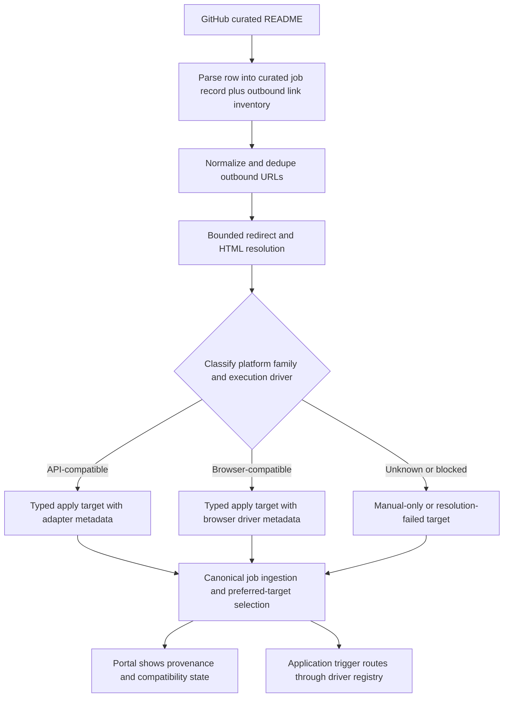

# feat: Make GitHub curated sources compatible with arbitrary apply links

## Overview

Upgrade the GitHub curated source flow so markdown rows can carry any outbound job or apply link without collapsing them into one generic `external_link` dead end. The system should preserve GitHub as an upstream discovery source, resolve downstream links into typed compatibility states, prefer the best executable target when one exists, and keep unknown links discoverable without pretending they are already safe to automate.

## Problem Frame

GitHub curated sources currently behave as broad discovery feeds, but the markdown they ingest often points at real downstream application surfaces such as Greenhouse, Lever, LinkedIn, and other company-hosted pages. Today `backend/app/integrations/github_curated/parser.py` reduces those links to generic `external_link` targets, while `backend/app/domains/applications/service.py` only knows how to execute fixed target types like `greenhouse_apply` and `lever_apply`. That leaves valuable compatibility information stranded inside GitHub markdown and makes the source feel discovery-only even when the feed is already pointing at a directly usable apply path.

This plan treats GitHub as a curation layer rather than the execution platform itself. The goal is to accept arbitrary downstream links, classify and resolve them carefully, and route them into the right execution lane: direct API adapter, browser-driven automation, or explicit discover-only/manual fallback. That preserves the origin intent from `docs/brainstorms/job-application-autopilot-requirements.md`: multi-source discovery, direct ATS preference, one canonical job per opportunity, and clear user-visible reasons when a job is discoverable but not auto-submittable.

## Requirements Trace

- R2-R4: GitHub curated sources must remain valid discovery inputs and normalize into the shared job shape.
- R5-R7: Duplicate GitHub and direct ATS sightings must still collapse to one canonical job while preferring the best direct apply path.
- R8-R9: The system must never create duplicate application attempts and must keep jobs discoverable even when their apply path is not yet automatable.
- R21-R23, R30-R31: The portal and logs must explain where the job came from, which apply target won, and why a target is or is not executable.
- Success Criteria 1-2: The daily sync must broaden useful job coverage without making application behavior opaque or brittle.

## Scope Boundaries

- This plan covers GitHub curated parsing, downstream link resolution, apply-target modeling, execution dispatch, and portal visibility for compatibility state.
- This plan does not guarantee unattended completion for every arbitrary website on day one; it guarantees that arbitrary links are accepted into a first-class compatibility pipeline instead of being flattened into one low-fidelity type.
- This plan does not redesign role-profile matching, question matching, or application retry policy beyond what is necessary to support richer apply-target metadata.
- This plan does not replace existing direct source types such as `greenhouse_board` or `lever_postings`; those remain important first-class discovery adapters.
- This plan does not require creating separate `job_sources` rows for every downstream domain found inside GitHub markdown.

## Context & Research

### Relevant Code and Patterns

- `backend/app/integrations/github_curated/parser.py` currently parses markdown and HTML tables into a single `DiscoveryCandidate` with `apply_target_type="external_link"`, which drops most downstream compatibility information.
- `backend/app/tasks/discovery.py` loads GitHub sources by fetching raw markdown and sending parser output directly into ingestion, with no downstream link-classification phase.
- `backend/app/domains/jobs/deduplication.py` and `backend/app/domains/jobs/target_resolution.py` already provide the right seam for canonical-job collapse and preferred-target selection, but they currently rank fixed string target types rather than richer compatibility metadata.
- `backend/app/domains/applications/service.py` executes only `greenhouse_apply` and `lever_apply`, while `backend/app/integrations/linkedin/apply.py` is a separate browser-driven path. That split is the adjacent-domain pattern to unify, not replace.
- `backend/app/domains/applications/routes.py` already dispatches between shared application execution and the LinkedIn-specific browser runner, which is the current entry point to generalize.
- `frontend/src/routes/sources.tsx` normalizes GitHub URLs on the client and presents no compatibility or downstream-resolution state, which means non-UI callers would miss the same normalization logic.
- `docs/plans/2026-04-02-001-feat-job-application-autopilot-plan.md` established GitHub curated feeds as discovery inputs and direct ATS targets as the preferred application path.
- `docs/plans/2026-04-05-006-feat-source-url-normalization-plan.md` established the current pattern of server-side URL derivation and clean validation errors for source connectors.

### Institutional Learnings

- No `docs/solutions/` artifacts currently exist for generic link resolution, multi-driver apply execution, or GitHub curated source upgrades.

### External References

- None used for this planning pass. The open questions here are primarily about repo architecture, capability modeling, and risk boundaries rather than framework behavior. Exact scraping heuristics and any library additions should be finalized during implementation.

## Key Technical Decisions

- **Keep GitHub as the upstream source of provenance, not the execution platform.** GitHub markdown rows should remain source sightings, while their outbound URLs are resolved into one or more apply-target candidates.
- **Separate link intake from execution compatibility.** The system should accept arbitrary URLs for discovery, then attach explicit compatibility state such as `api_compatible`, `browser_compatible`, `manual_only`, or `resolution_failed`.
- **Preserve outbound link inventory instead of flattening rows too early.** The GitHub parser should retain the row-level listing/apply/company links and any additional outbound anchors that materially affect execution choice.
- **Resolve links with bounded, deterministic scraping.** Redirect following, HTML inspection, and metadata extraction must use strict depth, timeout, and per-domain limits so one noisy source cannot turn a sync into unbounded crawling.
- **Move from hardcoded target-type branching toward a driver registry.** Existing Greenhouse, Lever, and LinkedIn flows should become drivers behind a shared compatibility contract so new link families do not require another service rewrite.
- **Prefer the most executable direct target without losing provenance.** A GitHub-sourced direct ATS target should outrank a generic intermediary link, but all targets and sightings should remain visible so the user can understand why one won.
- **Expose compatibility state to operators and the portal.** The user should be able to see whether a GitHub-discovered job is API-compatible, browser-compatible, manual-only, or unresolved, and why.
- **Move GitHub URL normalization and validation server-side.** The frontend can keep convenience hints, but the backend must own source validation so API callers and background flows behave consistently.

## Open Questions

### Resolved During Planning

- **Should downstream domains become separate `job_sources` records?** No. GitHub remains the upstream discovery source, and downstream destinations belong in apply-target and provenance metadata rather than source management UX.
- **Should arbitrary links all be auto-submitted immediately once ingested?** No. The system should accept and classify every link, but only route targets into unattended execution when they resolve to an explicit driver contract.
- **Should link resolution happen at source creation time?** No. Source creation should validate the GitHub markdown location only; downstream resolution belongs to sync-time row processing where real links are available.
- **Should preferred-target ranking stay a fixed target-type map?** No. Ranking should become capability-driven so upgraded targets can outrank generic/manual ones without encoding every future platform as a one-off priority constant.

### Deferred to Implementation

- The exact redirect and HTML inspection policy per domain should be validated during implementation; start with lightweight HTTP resolution and only escalate to browser inspection where HTTP metadata is insufficient.
- The first browser-compatible domain allowlist beyond the existing LinkedIn patterns can be finalized during execution once the driver registry lands.
- Whether to persist the full redirect chain verbatim or a compact provenance summary can be finalized after seeing migration and API shape costs.
- The exact row schema for multiple GitHub outbound links can be finalized during characterization work, but the parser must remain lossless enough that those links are not discarded.

## High-Level Technical Design

> *This illustrates the intended approach and is directional guidance for review, not implementation specification. The implementing agent should treat it as context, not code to reproduce.*

## Alternative Approaches Considered

- **Keep GitHub on a fixed supported-domain whitelist and ignore everything else.** Rejected because it preserves the current discovery-only feel and discards the richer intent already present in the markdown.
- **Convert every downstream domain into its own first-class source adapter before supporting it.** Rejected because it would overload source management, blur the line between discovery provenance and execution capability, and slow down support for new links.
- **Route every arbitrary link straight into generic browser automation.** Rejected because it collapses safe compatibility boundaries, raises scraping and blocker risk immediately, and makes unsupported flows fail too late and too opaquely.

## Implementation Units

- [ ] **Unit 1: Make GitHub parsing lossless enough for downstream compatibility work**

**Goal:** Preserve the outbound links embedded in GitHub markdown rows instead of flattening them into one generic apply target.

**Requirements:** R2-R4, R21-R23

**Dependencies:** None

**Files:**
- Modify: `backend/app/integrations/github_curated/parser.py`
- Modify: `backend/app/tasks/discovery.py`
- Modify: `backend/app/domains/jobs/deduplication.py`
- Test: `backend/tests/integrations/test_github_curated_parser.py`
- Test: `backend/tests/tasks/test_discovery_task.py`

**Approach:**
- Expand the GitHub parser contract so a row can carry upstream listing context plus a normalized inventory of outbound links worth evaluating.
- Keep the current canonical `DiscoveryCandidate` ingestion seam, but stop assuming GitHub rows always produce a single final `apply_url`.
- Preserve row provenance so later units can explain which downstream link produced which apply target.

**Execution note:** Add characterization coverage around current markdown and HTML parsing before changing the parser contract.

**Patterns to follow:**
- Mirror the source-adapter contract style already used in `backend/app/integrations/greenhouse/client.py` and `backend/app/integrations/lever/client.py`.
- Keep the parser as a pure normalization layer; do not bury downstream HTTP resolution inside the markdown parser.

**Test scenarios:**
- Happy path: a markdown row with a GitHub-facing listing link and a Greenhouse apply link preserves both links distinctly.
- Happy path: an HTML-table row with icon-based apply markup still emits the outbound destination URL inventory.
- Edge case: a row with multiple outbound anchors preserves the relevant links instead of silently discarding all but one.
- Error path: malformed rows without a company or title are skipped while valid rows continue parsing.
- Integration: `sync_source` can ingest GitHub rows from the expanded parser contract without regressing current job creation.

**Verification:**
- GitHub parsing no longer destroys downstream compatibility information needed for later link resolution.

- [ ] **Unit 2: Add a bounded downstream link-resolution and classification pipeline**

**Goal:** Turn arbitrary GitHub outbound URLs into typed compatibility records without making source sync unbounded or fragile.

**Requirements:** R2-R7, R9, R21-R23

**Dependencies:** Unit 1

**Files:**
- Create: `backend/app/domains/sources/link_resolution.py`
- Create: `backend/app/domains/sources/link_classification.py`
- Modify: `backend/app/tasks/discovery.py`
- Modify: `backend/app/domains/sources/url_normalization.py`
- Modify: `backend/app/integrations/github_curated/client.py`
- Test: `backend/tests/domains/test_link_resolution.py`
- Test: `backend/tests/tasks/test_discovery_task.py`

**Approach:**
- Introduce a sync-time resolution phase that normalizes URLs, follows bounded redirects, inspects lightweight HTML metadata when needed, and classifies each link into a platform family and execution driver.
- Extract metadata for directly supported patterns such as Greenhouse and Lever when the destination URL shape makes that safe and deterministic.
- Persist a failure reason or manual-only classification when a link cannot be resolved safely, rather than dropping the job or pretending it is executable.
- Cache normalized results within and across sync runs so large GitHub lists do not repeatedly probe the same outbound URLs.

**Technical design:** *(directional guidance, not implementation specification)* Use a two-step resolution contract: `normalize_and_follow(url) -> resolved_url + provenance`, then `classify_resolved_target(resolved_url, html_metadata) -> platform_family + execution_driver + extracted_metadata + compatibility_state`.

**Patterns to follow:**
- Follow the server-side normalization and validation pattern established in `backend/app/domains/sources/url_normalization.py`.
- Keep third-party fetch behavior contained in one domain layer rather than scattering URL heuristics across discovery, dedupe, and application code.

**Test scenarios:**
- Happy path: a Simplify or GitHub-curated outbound link that resolves to Greenhouse upgrades into a typed direct target with board and job identifiers.
- Happy path: a direct Lever apply URL resolves into a typed Lever-compatible target.
- Edge case: the same downstream URL with tracking parameters normalizes to one resolved target record.
- Error path: a timeout, redirect loop, or inaccessible page produces a manual-only or resolution-failed classification without aborting the entire source sync.
- Integration: one GitHub row with an intermediary listing link and a downstream direct ATS link yields a preferred direct target before target ranking runs.

**Verification:**
- GitHub sync can accept arbitrary outbound links while keeping per-link scraping bounded, explainable, and non-fatal.

- [ ] **Unit 3: Evolve apply-target modeling, dedupe, and preferred-target ranking around compatibility state**

**Goal:** Replace the current one-dimensional `target_type` preference model with richer target capability and provenance metadata.

**Requirements:** R4-R9, R21-R23, R30-R31

**Dependencies:** Unit 2

**Files:**
- Modify: `backend/app/domains/jobs/models.py`
- Modify: `backend/app/domains/jobs/deduplication.py`
- Modify: `backend/app/domains/jobs/target_resolution.py`
- Modify: `backend/app/domains/jobs/routes.py`
- Create: `backend/alembic/versions/*`
- Test: `backend/tests/domains/test_deduplication.py`
- Test: `backend/tests/domains/test_portal_list_routes.py`

**Approach:**
- Add capability-oriented metadata to `ApplyTarget` so the system can store execution driver, platform family, compatibility state, resolved destination, and provenance without losing backward compatibility for existing targets.
- Let GitHub-sourced targets upgrade from generic/manual entries to richer typed targets when resolution discovers a better downstream match.
- Rework preferred-target selection to rank by compatibility, directness, and confidence instead of only static target-type constants.
- Preserve every sighting and apply target so dedupe logic continues to tell the story of where the job was seen and why one target won.

**Patterns to follow:**
- Keep canonical-job collapse inside `backend/app/domains/jobs/deduplication.py` rather than moving preference logic into source adapters.
- Preserve the current invariant that direct ATS targets outrank intermediary ones when both resolve to the same opportunity.

**Test scenarios:**
- Happy path: a GitHub-discovered Greenhouse target outranks a generic intermediary link on the same job.
- Happy path: cross-source duplicates from GitHub and direct ATS ingestion still collapse to one canonical job with multiple sightings.
- Edge case: a previously stored generic target upgrades in place when a later sync resolves it to a direct compatible target.
- Error path: targets classified as manual-only remain attachable to the job without breaking dedupe or preferred-target selection.
- Integration: migrated pre-existing `external_link` targets keep sane defaults and do not become untriggerable after the schema change.

**Verification:**
- The job model can explain both where a target came from and how executable it is, while still selecting the right preferred target.

- [ ] **Unit 4: Generalize application dispatch behind a driver registry**

**Goal:** Support arbitrary-link compatibility without hardcoding every future platform into `execute_application_run`.

**Requirements:** R7-R9, R18-R25, R30

**Dependencies:** Unit 3

**Files:**
- Create: `backend/app/domains/applications/driver_registry.py`
- Modify: `backend/app/domains/applications/service.py`
- Modify: `backend/app/domains/applications/routes.py`
- Modify: `backend/app/integrations/linkedin/apply.py`
- Test: `backend/tests/domains/test_application_service.py`
- Test: `backend/tests/domains/test_application_trigger_routes.py`
- Test: `backend/tests/tasks/test_linkedin_retry_and_escalation.py`

**Approach:**
- Replace hardcoded target-type branching with a driver registry that maps compatibility metadata to an execution path.
- Treat existing Greenhouse and Lever integrations as the first direct-API drivers.
- Refactor the LinkedIn browser flow into the first browser-driver implementation so other browser-compatible links can eventually share the same contract.
- Return explicit validation or action-needed outcomes for manual-only or unresolved targets instead of trying to submit them blindly.

**Technical design:** *(directional guidance, not implementation specification)* Normalize dispatch around `driver = registry.resolve(target)`, then run `inspect_questions`, `resolve_answers`, and `submit` through that driver contract so API and browser paths share lifecycle semantics even when implementation details differ.

**Patterns to follow:**
- Reuse the question-inspection and answer-resolution flow already centralized in `backend/app/domains/applications/service.py`.
- Reuse the browser artifact and blocker patterns already present in `backend/app/integrations/linkedin/apply.py`.

**Test scenarios:**
- Happy path: existing Greenhouse and Lever targets still execute through the direct-API path after registry adoption.
- Happy path: a browser-compatible target resolves through the browser driver contract and preserves question-task creation behavior.
- Edge case: a target with no executable driver returns a clear operator-visible message without creating a misleading submitted run.
- Error path: a browser driver blocker still records artifacts and action-needed semantics instead of collapsing to a generic unsupported error.
- Integration: the application trigger route continues to use one endpoint while the driver choice changes under the hood.

**Verification:**
- Adding a new compatible link family no longer requires rewriting the core application service branching structure.

- [ ] **Unit 5: Expose compatibility state and provenance in the portal and source APIs**

**Goal:** Make the new compatibility model visible so the user can trust what GitHub-discovered jobs will and will not do.

**Requirements:** R21-R23, R27-R31

**Dependencies:** Units 3-4

**Files:**
- Modify: `backend/app/domains/jobs/routes.py`
- Modify: `backend/app/domains/sources/routes.py`
- Modify: `frontend/src/lib/api.ts`
- Modify: `frontend/src/routes/sources.tsx`
- Modify: `frontend/src/routes/jobs.tsx`
- Modify: `frontend/src/routes/job-detail.tsx`
- Test: `backend/tests/domains/test_source_routes.py`
- Test: `frontend/src/tests/portal-routes.test.tsx`

**Approach:**
- Extend source sync responses and job detail/list payloads so they can expose compatibility counts, preferred-target state, and provenance without forcing the frontend to infer them.
- Surface clear copy such as `API-compatible`, `Browser-compatible`, `Manual only`, or `Resolution failed`.
- Keep GitHub source creation simple, but move GitHub markdown URL validation to the backend and let the UI focus on hints rather than owning the real normalization logic.
- Show why a target is preferred and why a job remains discoverable even when it is not auto-submittable.

**Patterns to follow:**
- Keep backend errors user-facing in the same style already used by `backend/app/domains/sources/routes.py` and `frontend/src/routes/sources.tsx`.
- Reuse the current jobs list/detail pattern of exposing normalized state via API rather than frontend-derived business logic.

**Test scenarios:**
- Happy path: syncing a GitHub source returns compatibility-aware summary data that the UI can display without additional inference.
- Happy path: job detail shows multiple apply targets with one marked preferred and each target labeled by compatibility state.
- Edge case: a manual-only target remains visible and does not appear as auto-submittable in the portal.
- Error path: an invalid GitHub markdown URL returns a clean backend validation message instead of relying on frontend-only normalization.
- Integration: a GitHub-discovered job that resolves to a direct ATS target shows both GitHub provenance and the winning executable target in the UI.

**Verification:**
- The portal can explain the blast radius of a GitHub source sync and the execution status of each downstream target without hidden backend rules.

- [ ] **Unit 6: Add sync safeguards, observability, and rollout controls for arbitrary-link resolution**

**Goal:** Keep the new link-resolution pipeline operationally safe on large curated feeds.

**Requirements:** R1-R3, R21-R26

**Dependencies:** Units 2-5

**Files:**
- Modify: `backend/app/tasks/discovery.py`
- Modify: `backend/app/domains/sources/routes.py`
- Modify: `backend/app/domains/sources/models.py`
- Test: `backend/tests/tasks/test_source_scheduler.py`
- Test: `backend/tests/tasks/test_discovery_task.py`
- Test: `backend/tests/domains/test_source_routes.py`

**Approach:**
- Add bounded per-source controls for resolution concurrency, redirect depth, and timeout behavior, starting in advanced configuration rather than a large new UI surface.
- Record source-level counters for upgraded targets, browser-compatible targets, manual-only targets, and resolution failures so operators can tell whether a curated feed is improving useful coverage or just generating noise.
- Ensure row-level resolution failures never poison the whole source sync and that repeated duplicate links share cached results.
- Roll out broader browser-compatible execution behind explicit allowlists or capability flags until operational confidence is established.

**Patterns to follow:**
- Reuse the sync-control posture already present in `backend/app/domains/sources/sync_control.py` and `backend/alembic/versions/20260408_04_source_auto_sync_controls.py`.
- Keep source-level scheduling and sync summaries in the source domain rather than spreading operator state across unrelated modules.

**Test scenarios:**
- Happy path: a large GitHub feed with repeated outbound domains shares cached resolution results and completes within bounded sync rules.
- Edge case: per-link resolution timeouts increment failure counters without aborting the source sync.
- Error path: resolution failures are surfaced in sync summaries and remain distinguishable from parser failures or source-level outages.
- Integration: auto-sync continues to enqueue and process GitHub sources with the new safeguards without changing the external trigger flow.

**Verification:**
- Arbitrary-link support remains observable, rate-limited, and recoverable instead of turning GitHub sync into a black-box crawler.

## System-Wide Impact

- **Interaction graph:** GitHub parser output now flows through link resolution before dedupe and preferred-target selection, then into application dispatch and portal surfaces.
- **Error propagation:** Downstream link failures should stay row-scoped and target-scoped, surfacing as compatibility state or sync-summary counters rather than whole-source hard failures.
- **State lifecycle risks:** Existing generic targets may upgrade to richer targets over time, so schema and ranking logic must avoid duplicate targets, stale preferred flags, and lost provenance.
- **API surface parity:** Jobs list/detail, source sync responses, and application trigger behavior all need the same compatibility vocabulary so the UI does not invent its own meaning for target state.
- **Integration coverage:** Cross-layer tests should cover the path from GitHub markdown row -> resolved target -> deduped job -> preferred-target choice -> application trigger semantics.
- **Unchanged invariants:** The system must still maintain one canonical job per opportunity, preserve all source sightings, prefer direct ATS paths when available, and never auto-answer unknown required questions.

## Risks & Dependencies

| Risk | Mitigation |
|------|------------|
| Arbitrary outbound links vary widely in redirect behavior and HTML shape | Keep resolution bounded, capability-driven, and non-fatal; classify unknowns as manual-only rather than pretending they are automatable |
| Aggressive link probing can create rate-limit or anti-bot issues | Add caching, per-domain budgets, strict timeouts, and staged rollout for browser-compatible execution |
| Upgrading existing `external_link` targets could change preferred-target behavior unexpectedly | Add migration defaults, explicit ranking tests, and compatibility-state backfill rules |
| Generic browser execution can become too permissive too quickly | Reuse the LinkedIn browser contract, keep execution behind driver allowlists, and expose operator-visible blockers and artifacts |
| GitHub-specific normalization split across frontend and backend can drift | Move true validation to the backend and reduce the frontend to convenience-only normalization hints |

## Success Metrics

- GitHub source syncs produce a materially higher share of typed executable targets from the same markdown input.
- Duplicate jobs discovered from GitHub and direct ATS sources continue collapsing correctly while the preferred target becomes more often direct and executable.
- Manual-only and resolution-failed targets remain visible and explainable instead of silently disappearing or causing false automation attempts.
- Source sync reliability does not regress meaningfully as outbound link resolution is introduced.

## Phased Delivery

### Phase 1

- Land parser characterization, outbound-link preservation, bounded link resolution, and richer apply-target modeling.
- Goal: GitHub feeds stop discarding compatibility information even before broader execution support is enabled.

### Phase 2

- Move application dispatch behind the driver registry, expose compatibility in API/UI, and add rollout controls for browser-compatible targets.
- Goal: the system can safely act on more resolved links without hiding unsupported cases.

## Documentation / Operational Notes

- Update the root README and operator guidance once this lands so GitHub source setup explains the difference between upstream markdown location and downstream compatibility outcomes.
- Document the new compatibility vocabulary and source sync counters so manual-only and resolution-failed states are understandable to the user.
- Start with advanced per-source settings for outbound-resolution budgets before adding heavyweight source-form controls.

## Sources & References

- **Origin document:** `docs/brainstorms/job-application-autopilot-requirements.md`
- Related plan: `docs/plans/2026-04-02-001-feat-job-application-autopilot-plan.md`
- Related plan: `docs/plans/2026-04-05-006-feat-source-url-normalization-plan.md`
- Related code: `backend/app/integrations/github_curated/parser.py`
- Related code: `backend/app/tasks/discovery.py`
- Related code: `backend/app/domains/jobs/deduplication.py`
- Related code: `backend/app/domains/jobs/target_resolution.py`
- Related code: `backend/app/domains/applications/service.py`
- Related code: `backend/app/integrations/linkedin/apply.py`
