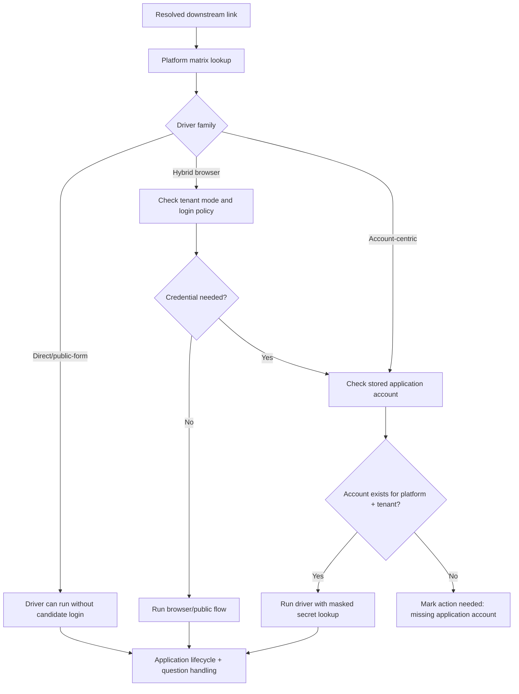

# feat: Add downstream platform matrix and application account profiles

## Overview

Create a separate companion plan to the GitHub compatibility work that answers two unresolved questions before implementation begins:

1. which downstream job-platform families should be treated as real next-driver targets after Greenhouse, Lever, and LinkedIn
2. how the product should store and use candidate login credentials for platforms that require employer-specific accounts, logins, or returning-candidate flows

This plan narrows the broad "arbitrary links" idea into a concrete platform matrix and a secure application-account model. The intent is to make the later driver work deliberate instead of open-ended.

## Problem Frame

The current GitHub compatibility plan correctly says that outbound links should be classified and routed into explicit compatibility states, but it intentionally stops short of deciding which platform families are worth first-class support and how candidate credentials should work for login-heavy platforms. That gap matters now.

Local repo context shows the current product shape is not ready for credentialed downstream platforms:

- `backend/app/domains/role_profiles/models.py` stores only targeting prompt and generated terms
- `backend/app/domains/accounts/models.py` stores only the owner account email and owner flag
- `backend/app/domains/applications/service.py` can execute only Greenhouse and Lever, with LinkedIn split into a separate browser runner
- the profile UI in `frontend/src/routes/role-profile.tsx` currently manages only role targeting, answers, and timezone preferences

At the same time, public platform behavior is not uniform:

- Ashby and SmartRecruiters expose public job-board and application APIs, making them strong candidates for direct-driver support
- Workday now spans both company-specific sign-in flows and newer conversational apply experiences that can remove logins/passwords entirely
- iCIMS explicitly documents employer-specific candidate profiles and unique login/password pairs per employer
- Jobvite exposes candidate account registration and hosted/integrated career-site flows, which makes account support useful even when application entry points vary

Without a separate plan, the GitHub compatibility work risks baking in a vague "browser-compatible later" bucket without deciding which platforms deserve direct drivers, which need credential-aware browser automation, and how those credentials should be modeled safely.

## Requirements Trace

- R2-R4: Discovery work must map downstream links into a stable shared platform vocabulary rather than a growing pile of one-off strings.
- R7-R9: Preferred apply-target selection must distinguish direct/public-form platforms from login-heavy or manual-only ones.
- R15-R20: Known application credentials belong in reusable profile state, just like known answers, but with stronger security boundaries.
- R21-R26: Application logs must explain whether a platform was blocked because of missing credentials, login failure, unsupported MFA, or unknown flow shape.
- R27-R30: The portal must let the user manage application readiness, not just discover jobs.
- R32-R33: This remains a single-user personal tool, so application accounts should be profile-scoped rather than built as a full shared enterprise credential system.

## Scope Boundaries

- This plan defines the platform-family matrix and the application-account profile model.
- This plan does not replace the GitHub compatibility plan; it constrains and sharpens that plan.
- This plan does not promise generic browser automation for every downstream link family.
- This plan does not add multiple applicant identities, per-role resumes, or team-shared credential vaults.
- This plan does not redesign owner authentication for the portal beyond what is needed to protect stored application credentials.
- This plan does not require implementing every researched platform immediately; it defines phased support tiers.

## Context & Research

### Relevant Code and Patterns

- `backend/app/domains/role_profiles/models.py` and `backend/app/domains/role_profiles/routes.py` show that the current "profile" concept is really a role-targeting profile, not a broader application identity model.
- `frontend/src/routes/role-profile.tsx` already acts as the centralized user profile screen, which makes it the right UI home for a future `Application Accounts` section or tab.
- `backend/app/domains/applications/service.py` and `backend/app/integrations/linkedin/apply.py` already show two execution lanes: direct API-ish drivers and browser automation. That split should become explicit instead of accidental.
- `backend/app/domains/sources/models.py` and `backend/app/domains/jobs/models.py` currently store source settings and apply-target metadata in JSON, including API keys in metadata. That is acceptable for low-volume internal API keys today, but it is the wrong default for candidate passwords.
- `docs/plans/2026-04-09-001-feat-github-arbitrary-link-compatibility-plan.md` introduced the compatibility-state model and driver registry direction but intentionally left platform prioritization and credential policy unresolved.

### External References

- Ashby public job postings and submission surfaces:
  - `https://developers.ashbyhq.com/docs/public-job-posting-api`
  - `https://developers.ashbyhq.com/reference/applicationformsubmit`
- SmartRecruiters public posting and application surfaces:
  - `https://developers.smartrecruiters.com/docs/posting-api`
  - `https://developers.smartrecruiters.com/docs/application-api-1`
  - `https://developers.smartrecruiters.com/docs/post-an-application`
- Workday candidate/login and conversational apply signals:
  - `https://www.workday.com/en-us/signin.html`
  - `https://www.workday.com/en-be/products/conversational-ai/candidate-experience.html`
  - `https://www.workday.com/en-se/products/conversational-ai/applicant-tracking-system.html`
- iCIMS candidate portal and credential behavior:
  - `https://community.icims.com/articles/HowTo/Candidate-Guide-to-the-iCIMS-Talent-Platform`
  - `https://community.icims.com/articles/Knowledge/Changing-Your-Password-Candidates-New-Hires`
- Jobvite candidate account and career-site integration behavior:
  - `https://app.jobvite.com/info/register.aspx`
  - `https://careers.jobvite.com/careersite/integration.html`
  - `https://careers.jobvite.com/careersite/features.html`
- Security guidance relevant to credential storage and outbound URL resolution:
  - `https://cheatsheetseries.owasp.org/cheatsheets/Secrets_Management_Cheat_Sheet.html`
  - `https://cheatsheetseries.owasp.org/cheatsheets/Cryptographic_Storage_Cheat_Sheet.html`
  - `https://cheatsheetseries.owasp.org/assets/Server_Side_Request_Forgery_Prevention_Cheat_Sheet_SSRF_Bible.pdf`

### Research Synthesis

| Platform family | Public platform signal | Likely execution lane | Credential posture | Recommended support tier |
|---|---|---|---|---|
| Greenhouse | Existing board/apply APIs already in repo | Direct API | Customer API key, no candidate login | Baseline existing |
| Lever | Existing posting/apply APIs already in repo | Direct API | Customer API key, no candidate login | Baseline existing |
| Ashby | Public job postings API and `applicationForm.submit` | Direct/public-form driver | No candidate account required for the core public apply flow | Phase 1 next driver |
| SmartRecruiters | Posting API plus full Application API | Direct/public-form driver | No candidate account required for the core API flow; candidate portal links may exist later | Phase 1 next driver |
| Workday | Company-specific sign-in plus newer text/chat application experiences | Browser-first hybrid | Login may be optional or required depending on employer tenant and product setup | Phase 2 pilot |
| iCIMS | Career-portal candidate guides and per-employer passwords/login | Browser/account driver | Employer-specific candidate profile and password required for returning flows | Phase 2 account-first |
| Jobvite | Candidate account registration plus hosted/integrated career-site flows | Browser/account hybrid | Account support is useful and sometimes expected, but exact entry varies by site | Phase 2 account-first |

This matrix implies three real execution buckets:

- **Direct/public-form platforms:** good candidates for first new drivers because the platform exposes stable public contracts
- **Hybrid/tenant-configurable platforms:** need browser-first handling and flow inspection before promising reliability
- **Candidate-account-centric platforms:** need credential modeling before driver work is even useful

## Key Technical Decisions

- **Treat this as a separate plan, not an edit to the GitHub compatibility plan.** The GitHub plan stays focused on link ingestion and driver routing; this plan defines which drivers exist and how credentials work.
- **Promote platform support by family, not one hostname at a time.** The registry should think in terms such as `ashby`, `smartrecruiters`, `workday`, `icims`, and `jobvite`, with host-pattern matching underneath.
- **Prioritize Ashby and SmartRecruiters as the first post-foundation drivers.** Public posting and application surfaces make them the lowest-risk next step after Greenhouse and Lever.
- **Treat Workday as a browser-first hybrid, not a guaranteed direct driver.** Public signals show Workday now spans both traditional sign-in flows and newer conversational apply experiences, so one universal Workday contract would be dishonest.
- **Treat iCIMS and Jobvite as account-aware platforms.** The product should assume credential storage and employer-specific login behavior are part of support for these families.
- **Expose application accounts in the profile UI, but store them outside `role_profiles`.** The role profile is about targeting and relevance. Application credentials are a separate secret-bearing domain and should not be stored as freeform JSON or text on the role profile row.
- **Model credentials by platform family plus tenant scope.** A single `email + password` pair is not enough. iCIMS in particular documents unique login/password per employer, and Workday sign-in is company-page-specific.
- **Make secrets write-only from the UI and non-returning from the API.** Users should be able to add or rotate a password, see masked metadata like email, platform, and tenant host, but never fetch the raw password back through the portal.
- **Require encrypted-at-rest credential storage with a separate key boundary.** Candidate passwords are more sensitive than the current owner login or source API settings, so they need dedicated key management and redaction rules.
- **Add credential policy to the platform matrix itself.** Each target family should declare whether credentials are `not_needed`, `optional`, `tenant_required`, or `unsupported_with_mfa`.

## Open Questions

### Resolved During Planning

- **Should user-managed platform logins live directly on the role profile model?** No. They should be managed from the Profile screen but stored in a separate application-account domain.
- **Should credentials be one per platform or one per employer tenant?** Tenant-scoped by default. iCIMS explicitly uses unique profiles per employer, and Workday login pages are company-specific.
- **Should credential-less platforms wait on the account-profile work?** No. Ashby and SmartRecruiters can move ahead as direct/public-form drivers while the account model is being built.
- **Should the product promise full Workday support as one driver?** No. Workday should start as a pilot family with sub-modes such as public/conversational and login-gated browser flows.

### Deferred to Implementation

- The exact encryption mechanism and key-rotation approach should be finalized during implementation, but it must honor separate-key storage and non-returning secret APIs.
- Whether Jobvite credentials are better treated as platform-global or tenant-scoped should be validated against representative career sites during implementation.
- MFA, CAPTCHA, and one-time email-code flows need explicit blocker taxonomy during implementation; this plan only establishes that they are not silently auto-solved.
- If the app later supports file uploads beyond resumes, the relationship between application accounts and stored profile artifacts can be refined after the first driver phase.

## High-Level Technical Design

> *This illustrates the intended approach and is directional guidance for review, not implementation specification. The implementing agent should treat it as context, not code to reproduce.*

## Implementation Units

- [ ] **Unit 1: Codify the downstream platform matrix and credential policy**

**Goal:** Turn platform research into a first-class registry the rest of the system can depend on.

**Requirements:** R2-R4, R7-R9

**Dependencies:** None

**Files:**
- Create: `backend/app/domains/applications/platform_matrix.py`
- Modify: `backend/app/tasks/discovery.py`
- Modify: `backend/app/domains/jobs/target_resolution.py`
- Test: `backend/tests/domains/test_platform_matrix.py`
- Test: `backend/tests/tasks/test_discovery_task.py`

**Approach:**
- Define a structured registry for supported platform families, host-pattern hints, driver family, credential policy, and rollout tier.
- Separate discovery-time classification from execution-time readiness so a target can be recognized before it is executable.
- Include at least these families in v1 of the matrix: `greenhouse`, `lever`, `linkedin`, `ashby`, `smartrecruiters`, `workday`, `icims`, and `jobvite`.

**Patterns to follow:**
- Reuse the compatibility vocabulary introduced in `docs/plans/2026-04-09-001-feat-github-arbitrary-link-compatibility-plan.md`.
- Keep target preference logic centralized in domain code rather than source adapters.

**Test scenarios:**
- Happy path: Ashby and SmartRecruiters URLs classify into direct/public-form families.
- Happy path: iCIMS and Jobvite URLs classify into account-aware families.
- Edge case: Workday URLs classify into a hybrid family without falsely claiming guaranteed direct-driver support.
- Error path: unrecognized URLs remain discoverable and fall back to manual or unresolved state.
- Integration: preferred-target ranking can consult platform family and credential policy instead of only a flat target-type string.

**Verification:**
- The system can answer "what kind of platform is this?" and "what does this platform need from the user?" without hardcoded branches scattered across the app.

- [ ] **Unit 2: Add secure application-account storage for candidate logins**

**Goal:** Create a safe place to store user-managed platform credentials needed for employer-specific or returning-candidate flows.

**Requirements:** R15-R20, R21-R26, R32-R33

**Dependencies:** Unit 1

**Files:**
- Create: `backend/app/domains/application_accounts/models.py`
- Create: `backend/app/domains/application_accounts/service.py`
- Create: `backend/app/domains/application_accounts/routes.py`
- Modify: `backend/app/config.py`
- Create: `backend/alembic/versions/*`
- Test: `backend/tests/domains/test_application_account_routes.py`
- Test: `backend/tests/domains/test_application_account_service.py`

**Approach:**
- Create a new profile-scoped domain for application accounts with fields such as platform family, tenant scope or host, login identifier, masked display metadata, credential status, and encrypted secret material.
- Keep passwords or secret tokens write-only. Reads should return only masked metadata and readiness state.
- Introduce a dedicated encryption-key configuration rather than reusing the session cookie secret.
- Capture rotation metadata like last updated time and last successful use without logging secret contents.

**Technical design:** *(directional guidance, not implementation specification)* Store a platform-scoped application account record and look up the secret only at execution time. API responses should serialize identity metadata, not the secret payload itself.

**Patterns to follow:**
- Follow the domain-and-routes layout already used for sources, answers, and role profiles.
- Follow OWASP-style key separation and least-privilege guidance for secret-bearing data instead of storing passwords in JSON fields or frontend-local state.

**Test scenarios:**
- Happy path: a user can create an iCIMS application account for a specific employer host with masked email/login metadata returned by the API.
- Happy path: a user can rotate a password without the API ever returning the old or new secret value.
- Edge case: two application accounts for the same platform but different tenant hosts are allowed.
- Error path: duplicate platform-plus-tenant account creation is rejected cleanly.
- Error path: logs and serialized responses never include plaintext credentials.
- Integration: execution-time secret lookup succeeds for a stored account while remaining opaque to normal read routes.

**Verification:**
- The product has a durable, secret-safe credential model that fits single-user autopilot without polluting role-targeting data.

- [ ] **Unit 3: Extend the profile UI to manage application accounts**

**Goal:** Let the user manage platform login readiness from the existing Profile area.

**Requirements:** R27-R30, R32-R33

**Dependencies:** Unit 2

**Files:**
- Modify: `frontend/src/routes/role-profile.tsx`
- Modify: `frontend/src/lib/api.ts`
- Modify: `frontend/src/tests/portal-routes.test.tsx`
- Test: `backend/tests/domains/test_application_account_routes.py`

**Approach:**
- Keep the Profile screen as the user’s central setup area, but add an `Application Accounts` section or tab rather than overloading the role-profile form.
- Make the UX explicit about scope: platform family, employer host/tenant, login email or username, password update, and status such as `ready`, `missing password`, or `login failed`.
- Surface action-oriented copy that explains why these credentials matter for login-heavy platforms.
- Allow password updates without pre-filling the stored password back into the form.

**Patterns to follow:**
- Reuse the tabbed pattern already established in `frontend/src/routes/role-profile.tsx`.
- Keep backend APIs narrowly shaped so the frontend does not infer security policy on its own.

**Test scenarios:**
- Happy path: the profile screen lists masked application accounts and allows adding a new account.
- Happy path: updating password fields succeeds without exposing the stored password value.
- Edge case: the same platform can have multiple tenant-scoped entries and the UI distinguishes them.
- Error path: invalid or duplicate tenant-host submissions show specific validation errors.
- Integration: saving an application account through the portal persists masked metadata and reflects readiness state without page reload drift.

**Verification:**
- A user can prepare login-heavy platform support from one clear profile surface without handling raw secrets in unsafe ways.

- [ ] **Unit 4: Wire credential policy into target readiness and driver dispatch**

**Goal:** Ensure platform accounts actually influence whether a resolved job target is ready to run.

**Requirements:** R7-R9, R18-R26, R30

**Dependencies:** Units 1-3 and the driver-registry work from `docs/plans/2026-04-09-001-feat-github-arbitrary-link-compatibility-plan.md`

**Files:**
- Modify: `backend/app/domains/jobs/models.py`
- Modify: `backend/app/domains/jobs/routes.py`
- Modify: `backend/app/domains/applications/service.py`
- Modify: `backend/app/domains/applications/routes.py`
- Create: `backend/app/domains/applications/driver_registry.py` or extend it if already landed
- Test: `backend/tests/domains/test_application_service.py`
- Test: `backend/tests/domains/test_application_trigger_routes.py`

**Approach:**
- Add target-readiness evaluation that combines platform family, compatibility state, and credential policy.
- Prevent trigger routes from attempting login-required drivers when no matching application account exists.
- Distinguish `missing_application_account`, `login_failed`, `mfa_required`, and `platform_not_supported` in user-visible status and logs.
- Keep manual-only and unresolved targets visible so the user can decide whether to add credentials or ignore the platform.

**Patterns to follow:**
- Reuse the existing application lifecycle and question-task flows rather than inventing a second execution model for account-aware drivers.
- Keep platform policy lookup centralized in the platform matrix.

**Test scenarios:**
- Happy path: an account-required target becomes `ready` when a matching application account exists.
- Edge case: two accounts for the same platform choose correctly based on tenant host.
- Error path: trying to run an iCIMS target without a matching stored account returns a specific actionable error.
- Error path: a failed login attempt records the failure without exposing the credential.
- Integration: jobs list/detail surfaces can show why a target is blocked before application execution begins.

**Verification:**
- Driver execution respects actual platform readiness instead of discovering missing credentials only after a brittle browser run starts.

- [ ] **Unit 5: Implement phased downstream driver rollout**

**Goal:** Turn the matrix into an implementation order that is ambitious but not reckless.

**Requirements:** R2-R9, R18-R26, Success Criteria 1-2

**Dependencies:** Units 1-4

**Files:**
- Modify: `backend/app/tasks/discovery.py`
- Create: `backend/app/integrations/ashby/client.py`
- Create: `backend/app/integrations/ashby/apply.py`
- Create: `backend/app/integrations/smartrecruiters/client.py`
- Create: `backend/app/integrations/smartrecruiters/apply.py`
- Create: `backend/app/integrations/workday/apply.py`
- Create: `backend/app/integrations/icims/apply.py`
- Create: `backend/app/integrations/jobvite/apply.py`
- Test: `backend/tests/integrations/test_ashby_ingest.py`
- Test: `backend/tests/integrations/test_ashby_apply.py`
- Test: `backend/tests/integrations/test_smartrecruiters_ingest.py`
- Test: `backend/tests/integrations/test_smartrecruiters_apply.py`
- Test: `backend/tests/integrations/test_workday_apply.py`
- Test: `backend/tests/integrations/test_icims_apply.py`
- Test: `backend/tests/integrations/test_jobvite_apply.py`

**Approach:**
- Phase 1: add Ashby and SmartRecruiters as direct/public-form drivers, since official docs show stable posting/application surfaces.
- Phase 2: add Workday as a pilot family with login-aware browser support and an explicit tenant-mode taxonomy rather than promising one universal driver.
- Phase 3: add iCIMS and Jobvite as account-aware browser drivers after application-account storage is proven in production-like usage.
- Gate each phase behind explicit allowlists or rollout flags so platform support can expand without destabilizing existing drivers.

**Patterns to follow:**
- Reuse the direct-driver patterns from Greenhouse and Lever where the public application contract is strong.
- Reuse the browser artifact and blocker patterns from LinkedIn for tenant-variable flows.

**Test scenarios:**
- Happy path: Ashby target classification yields a direct driver with no candidate account required.
- Happy path: SmartRecruiters pulls screening questions and submits a candidate application through the public application contract.
- Edge case: Workday target stays in pilot/browser mode until tenant-specific flow detection passes.
- Error path: iCIMS or Jobvite targets without application accounts remain visible but blocked with a clear remediation path.
- Integration: adding new drivers does not regress Greenhouse, Lever, or LinkedIn target dispatch.

**Verification:**
- Platform-family expansion becomes a phased roadmap rather than an open-ended promise to automate every unknown job site.

## System-Wide Impact

- **Interaction graph:** Link classification now depends on a platform matrix; execution readiness depends on stored application accounts; the profile UI becomes a setup surface for both targeting and platform readiness.
- **Error propagation:** Missing credentials, login failures, password resets, and unsupported MFA must surface as first-class operator states rather than generic apply failures.
- **State lifecycle risks:** Application accounts introduce secret rotation, stale credential detection, and tenant-scope matching concerns that do not exist in the current role profile model.
- **API surface parity:** Jobs list/detail, profile routes, and application trigger routes must all share the same readiness vocabulary for credentialed platforms.
- **Integration coverage:** Cross-layer tests should cover the path from resolved platform family -> account lookup -> readiness decision -> driver dispatch or blocked action-needed state.
- **Unchanged invariants:** The system still applies at most once per canonical job, still refuses to guess unknown answers, and still keeps unsupported jobs discoverable.

## Risks & Dependencies

| Risk | Mitigation |
|------|------------|
| Candidate passwords are far more sensitive than current source settings | Store them in a separate encrypted domain with dedicated key configuration, masked APIs, and strict log redaction |
| Workday, iCIMS, and Jobvite vary heavily by employer tenant | Treat them as phased or pilot families with tenant-scoped accounts and browser-first fallbacks rather than one universal contract |
| Credential management can bloat the existing role-profile abstraction | Keep the UI unified under Profile but model the data separately from `role_profiles` |
| Users may expect every platform to become fully automatable once credentials are added | Surface explicit readiness states and rollout labels like `pilot`, `account required`, and `manual only` |
| Outbound link probing plus credentialed browser flows increase abuse and lockout risk | Add per-platform rate limits, failed-login tracking, and conservative retry/backoff behavior |

## Phased Delivery

### Phase 1

- Land the platform matrix, secure application-account model, and profile UI support.
- Add Ashby and SmartRecruiters as the first new direct/public-form families.

### Phase 2

- Land target readiness based on stored accounts and pilot Workday browser support with tenant-mode classification.

### Phase 3

- Add iCIMS and Jobvite account-aware browser drivers once the credential model and readiness signals have proven stable.

## Documentation / Operational Notes

- Update the README and operator guidance so "Profile" now clearly includes application accounts in addition to role targeting and answers.
- Document per-platform credential expectations so the user knows which families require employer-specific accounts.
- Add rotation and incident-response notes for application accounts, including how to revoke or replace a compromised credential.
- Document blocked states such as `missing_application_account`, `password_reset_required`, and `mfa_required`.

## Sources & References

- **Origin document:** `docs/plans/2026-04-09-001-feat-github-arbitrary-link-compatibility-plan.md`
- Related requirements: `docs/brainstorms/job-application-autopilot-requirements.md`
- Related code: `backend/app/domains/role_profiles/models.py`
- Related code: `backend/app/domains/role_profiles/routes.py`
- Related code: `frontend/src/routes/role-profile.tsx`
- Related code: `backend/app/domains/applications/service.py`
- Related code: `backend/app/integrations/linkedin/apply.py`
- External docs:
  - `https://developers.ashbyhq.com/docs/public-job-posting-api`
  - `https://developers.ashbyhq.com/reference/applicationformsubmit`
  - `https://developers.smartrecruiters.com/docs/posting-api`
  - `https://developers.smartrecruiters.com/docs/application-api-1`
  - `https://community.icims.com/articles/HowTo/Candidate-Guide-to-the-iCIMS-Talent-Platform`
  - `https://community.icims.com/articles/Knowledge/Changing-Your-Password-Candidates-New-Hires`
  - `https://app.jobvite.com/info/register.aspx`
  - `https://www.workday.com/en-us/signin.html`
  - `https://www.workday.com/en-be/products/conversational-ai/candidate-experience.html`
  - `https://cheatsheetseries.owasp.org/cheatsheets/Secrets_Management_Cheat_Sheet.html`
