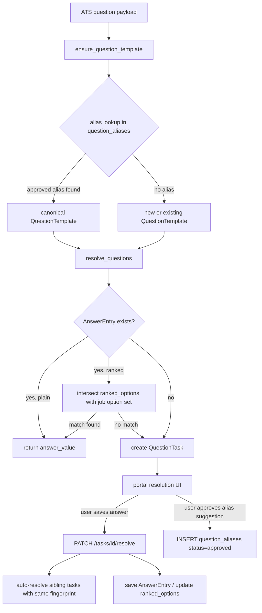

# feat: Answer system — deduplication, ranked preferences, and semantic matching

## Overview

Three practical problems make the current answers system frustrating at scale:

1. The same question (e.g. "email") appears as a separate prompt for every job that asks it, even after the user already answered it once — because `QuestionTask` is per-job and sibling tasks are never auto-resolved.
2. A saved preference (e.g. "preferred location = SF") cannot be applied to a new job whose option set is different (e.g. Tampa, Houston) — because template fingerprints include sorted options, so any option-set change produces a new unrelated template with no answer.
3. "Last name" and "family name" are treated as unrelated questions — because fingerprinting is textually exact with no semantic or alias layer.

This plan adds three complementary capabilities on top of the typed-answer-memory foundation already established in plan `003`:

- **Sibling auto-resolution:** when the user resolves a `QuestionTask`, all other tasks sharing the same fingerprint are auto-promoted to `reusable`.
- **Ranked preferences:** a user-managed ordered list of preferred options per canonical answer, used to auto-select the highest-ranked option available in any given job's option set.
- **Semantic alias suggestions:** AI-powered (cosine similarity over canonical answer descriptions, no vector DB required at current scale) suggestions that a new question might match an existing canonical answer, requiring explicit user approval before any binding is made.

## Problem Frame

The core data model — `QuestionTemplate` (per form shape), `AnswerEntry` (global answer), `QuestionTask` (per-job work item) — is sound. The problems are gaps in the orchestration layer, not the model itself (though ranked preferences require a small schema addition).

The three problems converge in `backend/app/domains/questions/matching.py::resolve_questions()`, which is the single choke-point for all answer lookups. That function currently:
- Returns the first `AnswerEntry` for a template with no `ORDER BY` (non-deterministic when duplicates exist)
- Does no ranked option intersection
- Has no alias or semantic lookup path

All three problems can be addressed by layering new logic into or around that function, without scrapping the existing model.

## Requirements Trace

- R15–R20 (from plan 003): maintain a reusable answer database, stop on unknown required questions, surface actionable tasks, reuse future answers safely.
- R22–R29 (from plan 003): provide portal-visible management for answers and question resolution.
- **New-R1:** Resolving one task for a fingerprint auto-resolves all sibling tasks for the same account.
- **New-R2:** Users can store ranked option preferences per canonical answer; the system selects the highest-ranked valid option for any new job's option set.
- **New-R3:** When ranked preferences yield no valid match for a job's option set, the system blocks the run and creates a new task — it does not silently submit an invalid value.
- **New-R4:** AI/similarity suggestions for semantically equivalent questions require explicit user approval before any canonical-answer binding is made; the system never auto-binds semantically similar questions.
- **New-R5:** The fingerprint identity contract is preserved: two questions with different option sets are still distinct `QuestionTemplate` rows. Semantic aliases are a lookup overlay, not a replacement for fingerprinting.

## Scope Boundaries

- This plan does not redesign the `CanonicalAnswer` / `QuestionResolution` split from plan 003 — it builds on top of it using the existing `AnswerEntry` + `QuestionTemplate` model, since plan 003 has not landed yet. If plan 003 lands first, Units 2 and 3 of this plan should be re-evaluated to target `CanonicalAnswer` instead of `AnswerEntry`.
- This plan does not introduce a vector database. Semantic similarity uses in-process cosine over stored text (Python `scikit-learn` or hand-rolled TF-IDF) — adequate for the expected number of canonical answers (tens to low hundreds).
- This plan does not implement per-job answer overrides (a user giving a different answer for one specific job vs. the global default). That is a distinct feature; see System-Wide Impact for why it's deferred cleanly.
- This plan does not change the fingerprint algorithm (prompt + field_type + sorted options). The fingerprint is the safety contract and must not be weakened.
- This plan does not auto-merge templates detected as semantically similar. Merge remains user-approved; the system only suggests.

## Context & Research

### Relevant Code and Patterns

- `backend/app/domains/questions/matching.py` — `resolve_questions()` is the entry point for all answer lookups; `ensure_question_task()` handles per-job task creation with existing deduplication per `(account_id, job_id, fingerprint)`
- `backend/app/domains/questions/fingerprints.py` — `fingerprint_question()` produces `normalized_prompt::normalized_type::sorted_options`; the `::` delimiter is not escaped — a known fragility
- `backend/app/domains/questions/models.py` — `QuestionTemplate`, `AnswerEntry`, `QuestionTask` with `account_id` on every row
- `backend/app/domains/questions/routes.py` — `PATCH /api/questions/tasks/{id}/resolve` is where sibling auto-resolution should be added
- `backend/app/domains/answers/routes.py` — `GET/POST/PUT /api/answers` and `/api/answers/upload`
- `backend/app/domains/applications/service.py` — consumes `resolve_questions()` output; `answers_by_key: dict[str, Any]` is the submission boundary
- `backend/app/domains/jobs/deduplication.py` — tiered matching pattern (exact → canonical → fuzzy) to follow for semantic alias lookup
- `backend/alembic/versions/20260402_01_initial_control_plane.py` — DDL conventions: `op.create_table`, `mapped_column`, `TimestampMixin`

### Institutional Learnings

- The fingerprint safety contract (prompt + type + sorted options) is explicit and intentional. Do not weaken it.
- Semantic / AI matching must never auto-bind without user approval — this was decided in `docs/plans/2026-04-02-001-feat-job-application-autopilot-plan.md`.
- Tiered resolution is the established pattern (see `deduplication.py`): exact → compatible → mismatch task. Semantic suggestion is tier N+1, always last.
- Every table must include `account_id` as the first filter — this is the personal-first / multi-user compatibility invariant already present on every existing model.
- `session.scalar(select(AnswerEntry).where(...))` has no `ORDER BY` today — non-deterministic when multiple entries exist for the same template. Fix this before layering ranking on top.

### External References

- No external research needed. All relevant patterns exist in the repo. Semantic similarity at this scale is standard Python (cosine similarity over TF-IDF vectors or simple token overlap).

## Key Technical Decisions

- **Sibling auto-resolution happens in the same DB transaction as the primary resolve.** After the primary task is linked to an `AnswerEntry` and set `reusable`, a bulk UPDATE sets all other `QuestionTask` rows for the same `(account_id, question_fingerprint)` with `status IN ("new", "pending")` to `reusable` and backfills `linked_answer_entry_id`. This avoids eventual-consistency windows where sibling tasks stay visible on the questions page after one is answered.

- **Ranked preferences are stored as a JSON array on `AnswerEntry.answer_payload` using the key `ranked_options`.** Shape: `{"ranked_options": ["SF", "Tampa", "Houston"]}` where index = rank (0 = highest preference). The existing `answer_payload` field already carries `{"value": "X"}` for single-select — `ranked_options` is an additive shape variant. Rationale: avoids a new table for v1; the ranked list is small (typically < 20 options); ranked preferences are a per-answer concern, not a separate entity.

- **Ranked option resolution MUST be resolved inside `resolve_questions()` before the `ResolvedQuestion` is returned, not at submission time.** `ResolvedQuestion.answer_value` is a property that returns raw `answer_payload` as a fallback — a `{"ranked_options": [...]}` dict reaching `answers_by_key` would be submitted directly to ATS drivers (Greenhouse, Lever, LinkedIn, etc.) as an invalid field value. The intersection (ranked_options ∩ job option_labels, case-insensitive, first match) must be computed in `resolve_questions()`, and if a match is found, the returned `ResolvedQuestion` must carry a synthetic `AnswerEntry` with `{"value": "<matched_option>"}` in `answer_payload` — or the intersection result must be stored as `answer_entry.answer_text` so `answer_value` returns a scalar string. If no match is found, `answer_entry = None` → `QuestionTask` created. This is a correctness requirement, not a convenience.

- **Ranked option resolution intersects ranked_options with the current job's option labels (case-insensitive), then selects the first match.** If no match is found, the answer is treated as missing and a `QuestionTask` is created — same as no answer at all. This prevents silent bad submissions (a real correctness risk identified in flow analysis). `resolve_questions()` receives the full `ApplyQuestion` (which carries `option_labels`) — the intersection has access to all needed data without any signature change.

- **Semantic alias suggestions use cosine similarity over prompt text, computed in-process at suggestion time.** No vector DB, no embeddings API call in the hot path. A `question_aliases` table stores user-approved mappings from one `QuestionTemplate` fingerprint to another (the canonical one). On `ensure_question_template()`, before creating a new template, the system checks `question_aliases` for an approved mapping. If found, the canonical template is used. If not found, the template is created and a background suggestion is queued (or computed lazily on portal load).

- **Alias suggestions require explicit user approval in the portal before any binding is committed.** The `question_aliases` table has a `status` column (`suggested` / `approved` / `rejected`). Only `approved` rows participate in template resolution. Rationale: false-positive semantic merges (e.g. "first name" merged with "last name") would silently corrupt submissions. User approval is the safety valve.

- **Alias resolution belongs in `resolve_questions()`, not in `ensure_question_template()`.** `ensure_question_template()` currently guarantees: "given this fingerprint, return the template with that exact fingerprint or create one." Changing it to return a different-fingerprint canonical template would break the semantic contract silently for all six callers (`applications/service.py` + five integration drivers: LinkedIn, Workday, iCIMS, Jobvite, generic_career_page). Instead, `resolve_questions()` should call a separate `resolve_alias(session, account_id, fingerprint) -> str` helper that returns the canonical fingerprint (or the same fingerprint if no alias exists), then call `ensure_question_template()` with the canonical fingerprint. This keeps `ensure_question_template()` deterministic and puts alias logic in the single place that already handles all answer lookup decisions.

- **`ensure_question_task()` must use the canonical fingerprint when writing new `QuestionTask` rows.** `QuestionTask.question_fingerprint` is a denormalized copy. If sibling tasks written before alias approval hold the source fingerprint and new tasks written after hold the canonical fingerprint, the upsert dedup check in `ensure_question_task()` (which queries by `question_fingerprint`) will fail to find the pre-alias task and create a duplicate. After alias approval, `resolve_questions()` passes the canonical fingerprint downstream, so `ensure_question_task()` writes the canonical fingerprint. Existing tasks with the source fingerprint should be migrated at alias-approval time via a bulk UPDATE (same transaction as setting `status=approved`).

- **`resolve_questions()` gets an explicit `ORDER BY` before any ranking logic is added.** Order by `AnswerEntry.created_at DESC` (latest wins for non-ranked answers). This eliminates the existing non-determinism before ranked preferences are layered on top.

## Open Questions

### Resolved During Planning

- **Should sibling resolution be synchronous or async?** Synchronous in the same transaction. The task count per fingerprint is small (one per job per question). An async job adds complexity with no benefit at current scale.
- **Should ranked preferences use a new table or extend `answer_payload`?** Extend `answer_payload` for v1. Avoids a migration for a small schema change, keeps the ranked list co-located with the answer, and is easily upgraded to a table later if query patterns demand it.
- **Should semantic similarity use an external embeddings API?** No. In-process cosine over stored prompt text is sufficient at current scale (tens of canonical answers, not millions). Adding an API call to the suggestion path creates latency, cost, and a new failure mode without proportional benefit.
- **Per-job answer overrides: in scope?** No. Keeping it out avoids a significant schema change (`job_id` FK on `AnswerEntry`, priority lookup in `resolve_questions`). It can be added as a separate plan without blocking this one.

### Deferred to Implementation

- Exact similarity threshold for semantic suggestions (start with 0.6 cosine, tune based on real data).
- Whether `question_aliases` suggestions are computed on every portal page load or queued as a background task on new template creation.
- Whether `AnswerEntry.answer_payload` ranked_options shape needs a migration to backfill existing single-select answers (likely not — `{"value": "X"}` and `{"ranked_options": ["X"]}` can coexist with a simple check in the resolver).
- Handling of multi-select questions with ranked preferences (intersection of ranked list with allowed options, take top N matches) — defer to implementation since multi-select ranking adds complexity beyond the core use case.

## High-Level Technical Design

> *This illustrates the intended approach and is directional guidance for review, not implementation specification. The implementing agent should treat it as context, not code to reproduce.*



**New `question_aliases` table (directional):**
```
question_aliases
  id, account_id
  source_fingerprint   -- the non-canonical fingerprint (e.g. "family name::input_text::")
  canonical_fingerprint -- the approved canonical fingerprint (e.g. "last name::input_text::")
  status               -- suggested | approved | rejected
  similarity_score     -- float, stored for auditability
  created_at, updated_at
```

**Ranked options payload shape (directional):**
- Plain single-select answer: `{"value": "SF"}`
- Ranked preferences answer: `{"ranked_options": ["SF", "Tampa", "Houston"]}`
- Resolver picks the first element of `ranked_options` that appears (case-insensitive) in the current job's `option_labels`.

## Implementation Units

- [ ] **Unit 1: Fix non-deterministic answer selection and add sibling auto-resolution**

**Goal:** Eliminate the duplicate-task UX problem (Problem 1) and fix the existing non-deterministic `AnswerEntry` query.

**Requirements:** New-R1

**Dependencies:** None — this is a pure orchestration change, no schema migration needed.

**Files:**
- Modify: `backend/app/domains/questions/matching.py`
- Modify: `backend/app/domains/questions/routes.py`
- Modify: `backend/tests/domains/test_question_matching.py` (or create if absent)
- Create: `backend/tests/domains/test_sibling_auto_resolution.py`

**Approach:**
- Add `ORDER BY AnswerEntry.created_at DESC` to the `resolve_questions` scalar query before any other change.
- In `PATCH /api/questions/tasks/{id}/resolve` (routes.py), after the primary task is committed, execute a bulk UPDATE on `QuestionTask` rows where `account_id = task.account_id AND question_fingerprint = task.question_fingerprint AND status IN ("new", "pending") AND id != task.id`. Set `status = "reusable"`, `linked_answer_entry_id = task.linked_answer_entry_id`, and `resolved_at = now()`. All three fields must be set — setting only `status` creates orphaned reusable tasks with no linked answer that will re-block on the next run.
- The bulk UPDATE must be in the same DB transaction as the primary resolve. Use SQLAlchemy's `update()` statement, not a loop.

**Patterns to follow:**
- `backend/app/domains/questions/routes.py` — existing resolve endpoint structure
- `backend/app/domains/questions/matching.py` — `ensure_question_task()` for how status transitions work

**Test scenarios:**
- Happy path: User resolves task T1 (Job A, fingerprint F). Task T2 (Job B, same fingerprint F, status "new") is automatically set to "reusable" with the same `linked_answer_entry_id`.
- Happy path: `GET /api/questions/tasks` after sibling auto-resolution returns only unresolved tasks (T2 no longer appears).
- Edge case: Resolving T1 when no sibling tasks exist (only task for fingerprint F) completes without error.
- Edge case: Resolving T1 when a sibling task T2 is already "reusable" — the bulk UPDATE must not change T2's existing `linked_answer_entry_id`.
- Edge case: Resolving T1 when sibling T3 has `status = "resolved"` — it must not be touched.
- Integration: After sibling auto-resolution, a new application run for Job B finds the `AnswerEntry` via `resolve_questions` and does NOT create a new task.

**Verification:**
- `GET /api/questions/tasks` shows zero tasks after the user resolves one task whose fingerprint has siblings.
- Application runs for all jobs sharing the fingerprint proceed to submission without re-blocking.

---

- [ ] **Unit 2: Add ranked preferences storage and resolution**

**Goal:** Allow users to store ordered option preferences per answer; auto-select highest-ranked valid option for any job's option set (Problem 2).

**Requirements:** New-R2, New-R3

**Dependencies:** Unit 1 (deterministic answer selection must be in place first)

**Files:**
- Modify: `backend/app/domains/questions/matching.py`
- Modify: `backend/app/domains/answers/routes.py`
- Modify: `frontend/src/lib/api.ts`
- Modify: `frontend/src/routes/questions.tsx` (resolution UI)
- Create: `backend/tests/domains/test_ranked_preferences.py`
- Modify: `frontend/src/tests/portal-routes.test.tsx`

**Approach:**
- In `resolve_questions()`, after fetching the `AnswerEntry`, check if `answer_payload` contains `ranked_options`. If present, intersect the list (case-insensitive) with the current `ApplyQuestion.option_labels` (already available in the loop — no signature change needed). If a match is found, the function must return a `ResolvedQuestion` where `answer_entry` carries a payload shape that `answer_value` will resolve to a scalar string (`{"value": "<matched>"}` or set `answer_text = "<matched>"`). **Do not return the raw `{"ranked_options": [...]}` dict** — it will be passed directly to ATS submission drivers. If no match is found, treat as `answer_entry = None` (→ creates a `QuestionTask`).
- The existing `{"value": "X"}` shape must still work unchanged — this is additive.
- The `PUT /api/answers/{answer_id}` endpoint (full-replacement semantics, all four fields overwritten) must accept a `ranked_options` key in the `answer_payload` body.
- Frontend: in the resolution UI, for single-select tasks, add a "Set as ranked preference" toggle. When enabled, instead of storing `{"value": "X"}` the user sees a reorder list of all options they've previously chosen (across jobs) plus the current job's options. The saved payload becomes `{"ranked_options": [...ordered list...]}`.
- When the ranked resolution finds no match and creates a new `QuestionTask`, the task's `option_labels` shows the current job's options alongside the user's ranked preferences so they can extend the ranking.

**Patterns to follow:**
- `backend/app/domains/questions/matching.py` — `resolve_questions()` for the answer lookup pattern
- `backend/app/domains/answers/routes.py` — existing `PUT /api/answers/{id}` for the update endpoint shape

**Test scenarios:**
- Happy path: Job A options = [SF, NYC], ranked_options = ["SF", "NYC"]. Resolver returns "SF" (rank 0). No task created.
- Happy path: Job B options = [Tampa, Houston, SF], ranked_options = ["SF", "Tampa"]. Resolver returns "SF" (highest rank present). No task created.
- Happy path: Job C options = [Tampa, Houston], ranked_options = ["SF", "Tampa"]. Resolver returns "Tampa" (SF absent, Tampa is next). No task created.
- Edge case: Job D options = [Boston, Chicago], ranked_options = ["SF", "Tampa"]. No match. Task created. Existing ranked answer NOT submitted.
- Edge case: ranked_options = [] (empty list). Treated as no answer. Task created.
- Edge case: option label comparison is case-insensitive ("sf" matches "SF").
- Edge case: existing plain `{"value": "SF"}` answer works unchanged — not broken by ranked logic.
- Integration: after user extends ranking to include "Boston" for Job D and re-runs, the resolver finds "Boston" and submits successfully.

**Verification:**
- `resolve_questions()` returns a valid option value when a ranked preference intersects the job's option set.
- `resolve_questions()` creates a task (no answer returned) when no ranked option intersects.
- Submission adapter receives a valid option string, not a list, for single-select fields.

---

- [ ] **Unit 3: Add `question_aliases` table and alias resolution layer**

**Goal:** Enable semantic deduplication by storing user-approved mappings between equivalent-question fingerprints (Problem 3), so "family name" resolves to the same canonical answer as "last name".

**Requirements:** New-R4, New-R5

**Dependencies:** None (independent schema addition; can land before or after Units 1 and 2)

**Files:**
- Create: `backend/alembic/versions/20260410_01_question_aliases.py`
- Modify: `backend/app/domains/questions/models.py`
- Modify: `backend/app/domains/questions/matching.py`
- Create: `backend/app/domains/questions/routes.py` (new endpoints: list suggestions, approve/reject alias)
- Modify: `backend/app/main.py` (register new route)
- Modify: `frontend/src/lib/api.ts`
- Modify: `frontend/src/routes/questions.tsx` (suggestion UI)
- Create: `backend/tests/domains/test_question_aliases.py`
- Modify: `frontend/src/tests/portal-routes.test.tsx`

**Approach:**
- New `question_aliases` table: `id`, `account_id`, `source_fingerprint`, `canonical_fingerprint`, `status` (`suggested`/`approved`/`rejected`), `similarity_score` (float), `created_at`, `updated_at`. Unique constraint on `(account_id, source_fingerprint)` — one canonical mapping per source per account.
- In `resolve_questions()`, add a `resolve_alias(session, account_id, fingerprint) -> str` helper (returns canonical fingerprint or same fingerprint if no approved alias). Call it before `ensure_question_template()`. Do NOT change `ensure_question_template()` — its contract (exact fingerprint → template) must remain stable for all callers.
- Semantic suggestion generation: when a new `QuestionTemplate` is created (no approved alias found), compute similarity between the new prompt text and all existing template prompt texts for the account (normalized). Use `difflib.SequenceMatcher` ratio — no additional dependency needed for v1. Cross-type pairs (different `field_type`) must NOT generate suggestions. If any same-type pair exceeds threshold (default 0.6), insert a `question_aliases` row with `status = "suggested"`.
- At alias approval (`PATCH /api/questions/aliases/{id}` with `status=approved`): (1) enforce bidirectional loop guard, (2) bulk-update existing `QuestionTask` rows for the source fingerprint to use the canonical fingerprint and canonical `question_template_id` (same transaction), (3) set alias status = approved and commit.
- New API endpoints: `GET /api/questions/aliases?status=suggested` (list suggestions), `PATCH /api/questions/aliases/{id}` (approve/reject). Both scoped by `account_id`.
- Frontend: a "Review suggestions" section in the questions portal showing pairs like "family name ↔ last name — treat as the same question?". User clicks Approve or Reject.

**Patterns to follow:**
- `backend/alembic/versions/20260402_01_initial_control_plane.py` — migration DDL style
- `backend/app/domains/questions/models.py` — `TimestampMixin, Base, mapped_column` pattern
- `backend/app/domains/jobs/deduplication.py` — tiered lookup, cheap checks first

**Test scenarios:**
- Happy path: "family name" (input_text) is created as a new template; similarity to "last name" (input_text) exceeds threshold; a `suggested` alias row is created.
- Happy path: user approves the alias; next run for a job asking "family name" resolves to the "last name" template's answer without creating a new task.
- Happy path: user rejects the alias; next run for "family name" correctly creates a new task as a genuinely separate question.
- Edge case: threshold not met (e.g. "preferred start date" vs "last name") — no alias row created.
- Edge case: two templates with different `field_type` (e.g. "name::input_text" and "name::single_select") are not suggested as aliases (similarity check should weight field_type heavily or exclude cross-type pairs entirely).
- Edge case: alias loop — source A → canonical B, then B → C attempted. The system should not create transitive chains; canonical must always be a non-aliased template.
- Error path: approving an alias when the source fingerprint already has an approved alias (unique constraint violation) returns a clear error.
- Integration: a full application run for a job asking "family name" where an approved alias to "last name" exists: the run finds the "last name" answer and submits without blocking.

**Verification:**
- `GET /api/questions/aliases?status=suggested` returns pairs when new semantically-similar templates are created.
- Approving an alias causes future `ensure_question_template()` calls for the source fingerprint to return the canonical template.
- No auto-binding occurs without explicit user approval (status must be `approved`).

---

- [ ] **Unit 4: Portal UX — surface ranked preferences and alias suggestions**

**Goal:** Give users the UI affordances to manage ranked preferences and review alias suggestions without requiring deep system knowledge.

**Requirements:** New-R2 (ranked UX), New-R4 (alias approval UX)

**Dependencies:** Units 2 and 3 (backend APIs must exist first)

**Files:**
- Modify: `frontend/src/routes/questions.tsx`
- Modify: `frontend/src/lib/api.ts` (new alias API types)
- Modify: `frontend/src/styles/app.css`
- Create: `frontend/src/tests/ranked-preferences.test.tsx`
- Modify: `frontend/src/tests/portal-routes.test.tsx`

**Approach:**
- Task resolution card for single-select questions: show current job's options as radio buttons. Below the options, show the user's existing ranked preference list (if any) with "Edit ranking" affordance. When "Edit ranking" is open, user can reorder and add new options (draggable list or numbered inputs — keep it simple for v1).
- Alias suggestions section: a collapsible panel on the questions page titled "Suggested question matches." Each row shows: source prompt, canonical prompt, similarity score (shown as "These look similar" — not a raw float), Approve / Ignore buttons.
- Job context on task cards: include company name and job title on each task card (backend already has `job_id` on `QuestionTask`; the response schema needs `company_name` and `job_title` added — coordinate with backend route change).
- When ranked resolution fails (Job D from Unit 2 test scenario), the task card shows the user's existing ranked list alongside the new option set, pre-highlighting options not yet in their ranked list. The user can click to add options and save an updated ranking.

**Patterns to follow:**
- `frontend/src/routes/questions.tsx` — existing task card structure, `compatibleAnswersForTask` pattern
- `frontend/src/lib/api.ts` — existing `QuestionTask`, `AnswerEntry` TypeScript types

**Test scenarios:**
- Happy path: a single-select task renders the job's options and the user's existing ranked list correctly.
- Happy path: the alias suggestions panel shows one suggestion for a "suggested" alias; clicking Approve calls the PATCH endpoint and the panel refreshes.
- Happy path: clicking Ignore sets the alias to "rejected" and it disappears from the suggestions panel.
- Edge case: no alias suggestions → panel is hidden or shows empty state.
- Edge case: ranked list is empty → user sees normal radio options with no ranked-list section.
- Integration: after approving an alias suggestion in the portal, re-running the blocked application proceeds to submission without requiring the user to answer again.

**Verification:**
- Ranked preference list renders and saves correctly for a single-select question.
- Alias suggestion panel appears with at least one suggestion when a new semantically-similar template exists.
- Approving an alias from the portal completes without error and removes the suggestion from the panel.

## System-Wide Impact

- **`resolve_questions()` has six callers — all must benefit from changes.** Beyond `applications/service.py`, `resolve_questions()` is called by `integrations/linkedin/apply.py`, `integrations/generic_career_page/apply.py`, `integrations/jobvite/apply.py`, `integrations/workday/apply.py`, and `integrations/icims/apply.py`. Ranked resolution and alias lookup in `resolve_questions()` apply automatically to all six callers with no changes needed in the integration drivers. The submission boundary (`answers_by_key: dict[str, Any]`) must remain a dict of scalar values — the ranked intersection must be resolved to a string before `answer_value` is read.

- **`ensure_question_template()` must NOT change its return semantics.** It currently guarantees: return the template matching this exact fingerprint or create one. That contract must be preserved for all six callers. Alias lookup is handled upstream in `resolve_questions()` via a `resolve_alias()` helper before `ensure_question_template()` is called.

- **Sibling auto-resolution bulk UPDATE must set `linked_answer_entry_id` AND `resolved_at`.** Setting only `status = "reusable"` without `linked_answer_entry_id` creates orphaned tasks — they appear resolved but have no answer to read on re-run. The bulk UPDATE must mirror what `mark_question_task_resolved()` does for individual tasks: set `status`, `linked_answer_entry_id`, and `resolved_at` in the same statement.

- **Alias approval must migrate existing `QuestionTask` rows to the canonical fingerprint.** `ensure_question_task()` deduplicates by `(account_id, job_id, question_fingerprint)`. After alias approval, `resolve_questions()` uses the canonical fingerprint, so new tasks are written with it. Existing tasks for the source fingerprint become invisible to the upsert check and duplicates are created on the next run. At alias-approval time, a bulk UPDATE must set `QuestionTask.question_fingerprint = canonical_fingerprint` and `QuestionTask.question_template_id = canonical_template.id` for all existing tasks with the source fingerprint (any status, same account).

- **Per-job answer overrides remain out of scope.** `AnswerEntry` has no `job_id` column. The sibling auto-resolution in Unit 1 assumes the same answer is correct for all jobs sharing a fingerprint. If a user needs a different answer per job, they must create a separate `AnswerEntry` and manually link the job's task to it — the existing resolve flow supports this. A full per-job override system is a separate plan.

- **Failure propagation:** If ranked option intersection returns no match, the behavior is identical to "no answer found" — a `QuestionTask` is created and the run is blocked. This must not fall through to submitting a list-valued payload to any ATS adapter. The `ResolvedQuestion.answer_value` property's fallback branch (returns raw `answer_payload` when neither `value` nor `values` is present) must never be reached for a `ranked_options` payload.

- **`ORDER BY AnswerEntry.created_at DESC` changes which answer wins when multiple entries exist per template.** This is an existing correctness bug being fixed. There is no `is_active` flag — latest-created wins after this change. Any user who has multiple `AnswerEntry` rows for the same template should be made aware via the answer management UI that only the most recently created is active.

- **Similarity computation on template creation:** O(N) over account templates synchronously. Acceptable at current scale (tens of templates). If an account grows into hundreds, move to a background task triggered by template insertion.

## Risks & Dependencies

| Risk | Mitigation |
|------|------------|
| `ranked_options` dict reaches ATS submission driver as invalid payload | `ResolvedQuestion.answer_value` returns raw `answer_payload` as fallback. The ranked intersection MUST be resolved to a scalar string inside `resolve_questions()` before `answer_value` is ever read. Unit 2 approach explicitly requires this. Test must verify `answer_value` returns a `str`, not a `dict`. |
| Ranked no-match silently submits empty value | Treat no-match identically to missing answer: `answer_entry = None`, `QuestionTask` created, run blocked. Unit tested explicitly. |
| Sibling auto-resolution sets status but not linked_answer_entry_id | Bulk UPDATE must set `status`, `linked_answer_entry_id`, and `resolved_at` — mirroring `mark_question_task_resolved()`. |
| Sibling auto-resolution modifies tasks for the wrong account | Bulk UPDATE must include `account_id = task.account_id` in WHERE clause. Test with multi-account fixture. |
| Semantic alias false positive (e.g. "first name" → "last name") | Require explicit user approval (status = "approved") before any alias affects resolution. Rejected aliases are stored for auditability. |
| Alias chain / loop (A → B → C) corrupts resolution | Bidirectional guard at approval: (1) reject if `canonical_fingerprint` is already a `source_fingerprint` in any approved row, AND (2) reject if `source_fingerprint` is already a `canonical_fingerprint` in any approved row. Both checks together close all two-hop chains without graph traversal. |
| `ranked_options` payload shape breaks existing `answer_value` property | The resolver must check for `ranked_options` key first; fall back to `value` / `answer_text`. Existing tests must still pass. |
| Alias approval leaves existing `QuestionTask` rows with stale source fingerprint | At alias approval time, bulk-update all `QuestionTask` rows with `source_fingerprint` to `canonical_fingerprint` and `canonical_template_id` in the same transaction. Specified in Unit 3 approach. |
| Plan 003 lands concurrently and renames `AnswerEntry` to `CanonicalAnswer` | Units 2 and 3 of this plan target `AnswerEntry`. If plan 003 lands first, these units must be re-targeted. Coordinate at implementation time. |

## Documentation / Operational Notes

- No new environment variables required.
- No background job infrastructure needed for v1 (similarity computed synchronously on template creation).
- Migration `20260410_01_question_aliases.py` is additive (new table only) — safe to run on live data.
- After shipping Unit 1, the questions task queue should visibly shrink for users who have already answered recurring questions across jobs.

## Sources & References

- **Origin document:** [docs/plans/2026-04-03-003-feat-question-answer-memory-plan.md](docs/plans/2026-04-03-003-feat-question-answer-memory-plan.md)
- Related code: `backend/app/domains/questions/matching.py`, `backend/app/domains/questions/routes.py`, `backend/app/domains/answers/routes.py`
- Related plan: [docs/plans/2026-04-02-001-feat-job-application-autopilot-plan.md](docs/plans/2026-04-02-001-feat-job-application-autopilot-plan.md) (semantic auto-bind prohibition)
- Related plan: [docs/plans/2026-04-03-003-feat-question-answer-memory-plan.md](docs/plans/2026-04-03-003-feat-question-answer-memory-plan.md) (typed answer memory foundation)
